## Conda

### Overview

Conda is an open-source package management and environment management system that runs on Windows, macOS, and Linux. This guide walks through installing Conda via the Miniconda distribution, which provides a minimal Conda setup.

### Installation Steps

#### 1. Download the Miniconda Installer

Visit the official Miniconda download page:

[Miniconda download page](https://www.anaconda.com/download/success)

Choose the installer that matches your operating system:

- **Windows:** Miniconda3 Windows 64-bit Graphical Installer
- **macOS:** Miniconda3 macOS Intel or Apple Silicon Graphical Installer
- **Linux:** Miniconda3 Linux 64-bit (x86) Installer

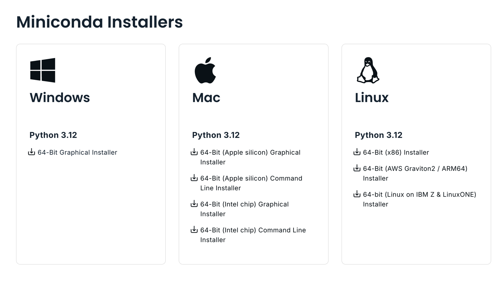

#### 2. Install Miniconda

**On Windows/macOS**

1. Run the downloaded installer (`.exe` on Windows or `.pkg` on macOS).
2. Follow the installation wizard:
   - Accept the license agreement.
   - Choose an installation location. The default is recommended.
   - Select the option to add Miniconda to your `PATH` environment variable, if offered.
3. Complete the installation.

**On Linux**

1. Open a terminal.
2. Navigate to the folder containing the installer.
3. Run:

```bash
bash Miniconda3-latest-Linux-x86_64.sh
```

4. Follow the prompts:
   - Read and accept the license agreement.
   - Confirm the installation location.
   - Initialize Conda in your shell when prompted.

#### 3. Verify the Installation

Open a terminal or command prompt and run:

```bash
conda --version
```

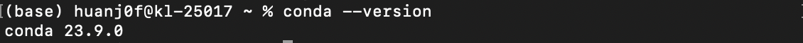

#### 4. Post-Installation Configuration

Initialize Conda if needed:

```bash
conda init
```

Create and activate a test environment:

```bash
conda create -n test_env python=3.9
conda activate test_env
```

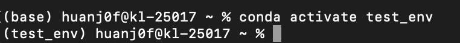


## Artemis

### Overview

Artemis is a free genome browser and annotation tool that allows visualisation of sequence features, next generation data and the results of analyses within the context of the sequence, and also its six-frame translation. Artemis is written in Java, and is available for UNIX, Macintosh and Windows systems. It can read EMBL and GENBANK database entries or sequence in FASTA, indexed FASTA or raw format. Other sequence features can be in EMBL, GENBANK or GFF format.

### Installation Steps

1. Create a new conda environment

```bash
conda create -n artemis
```

2. Activate your artemis environment

```bash
conda activate artemis
```

3. Add conda channels

```bash
conda config --add channels bioconda
conda config --add channels conda-forge
```

4. Install Artemis

```bash
conda install artemis
```

### Verify the Installation

Open Artemis

```bash
art
```

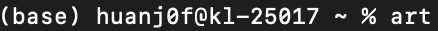

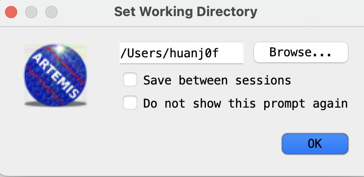

## Artemis


### Introduction

Artemis is a freely available DNA visualisation and annotation tool developed by Kim Rutherford at the Sanger Institute. This software supports a variety of file formats, including simple sequence files (e.g., FASTA) and EMBL/GenBank entries, as well as the results of sequence analyses. It provides an interactive and user-friendly graphical interface for exploring genomic data. Commonly utilised by the Pathogen Genomics group, Artemis facilitates the annotation and analysis of both prokaryotic and eukaryotic genomes and allows users to visualise mapped next-generation sequencing data. The tool supports the simultaneous display of multiple types of information in various contexts. For instance, users can examine the same genomic region at different scales, such as zooming in on DNA sequence motifs or zooming out to analyse gene architecture (e.g., operons) or entire chromosomes and genomes, all within a single screen. Additionally, Artemis enables users to perform in-software analyses and save the results for future use. This tutorial includes adapted figures and content from the Genomics Course tutorial by the Wellcome Sanger Institute, used with acknowledgement and for educational purposes.

### Aims

This module is designed to help you become acquainted with the core functions of Artemis through a series of practical examples. These examples focus on introducing the most essential and frequently used features. However, you are encouraged to take time to explore additional menus and functions of Artemis that are not covered in the exercises, as they may hold particular relevance for certain users.

## Artemis Exercise 1

### 1. Starting up the Artemis software

Type `art` in your terminal to open Artemis, then click **OK** to confirm the working directory.

```bash
art
```

A small start-up window will open (refer to the image below), click ‘OK’ to set the home directory (keep default path). All the necessary files for this module can be found in the Day3_Artemis directory.

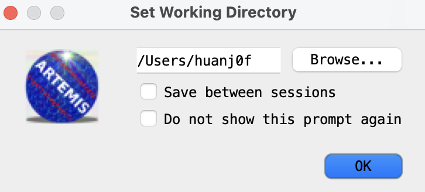

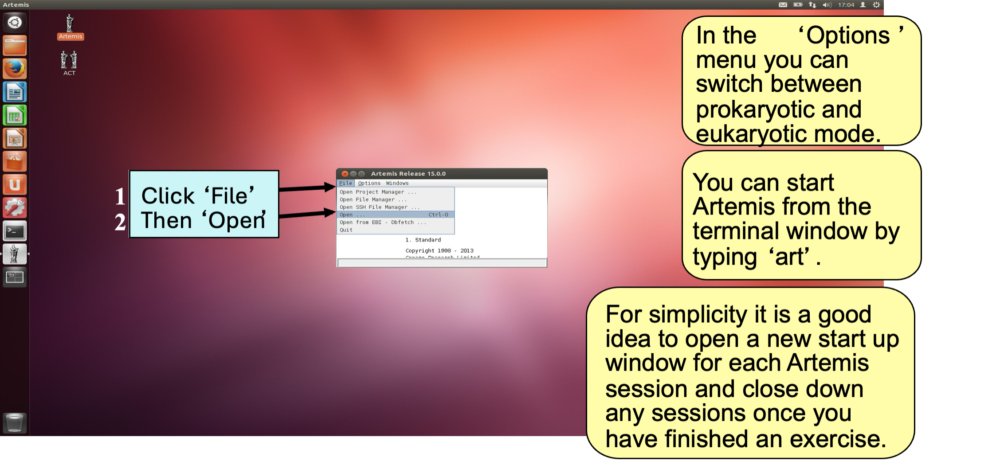

Follow the numbered steps provided to load the Salmonella Typhi complete sequence. If you encounter any difficulties, don’t hesitate to ask a demonstrator for assistance.

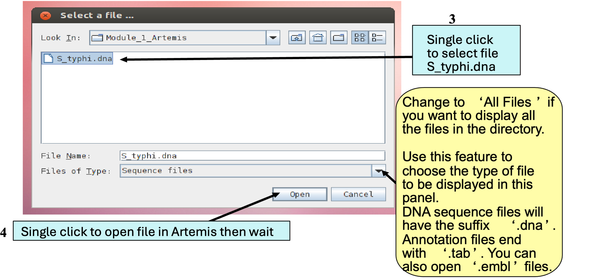

### 2. Loading an annotation file (entry) into Artemis

Hopefully you will now have an Artemis window like this!

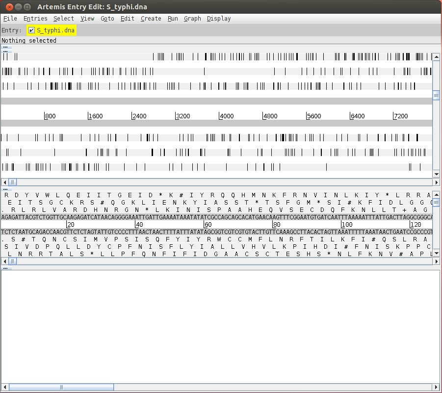

Now follow the numbers to load the annotation file for the *Salmonella* Typhi chromosome.

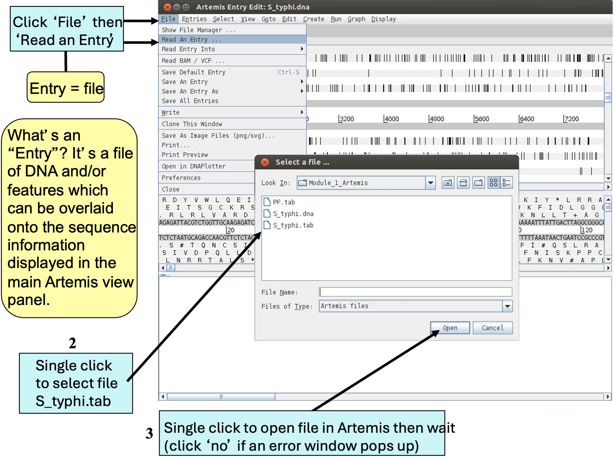

### 3. The basics of Artemis

Now you have an Artemis window open let’s look at what’s in there.

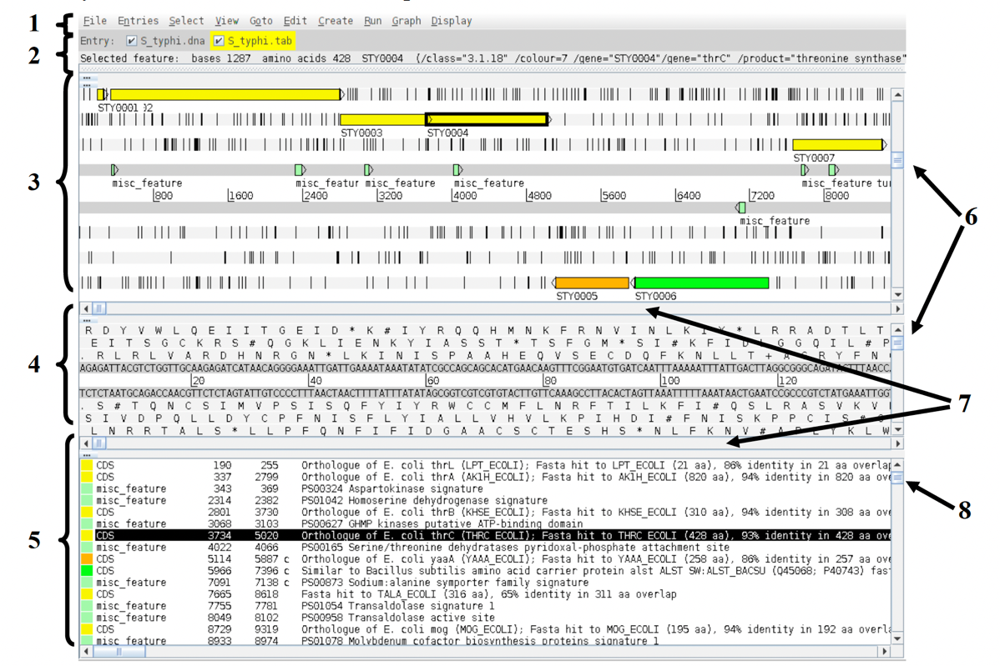

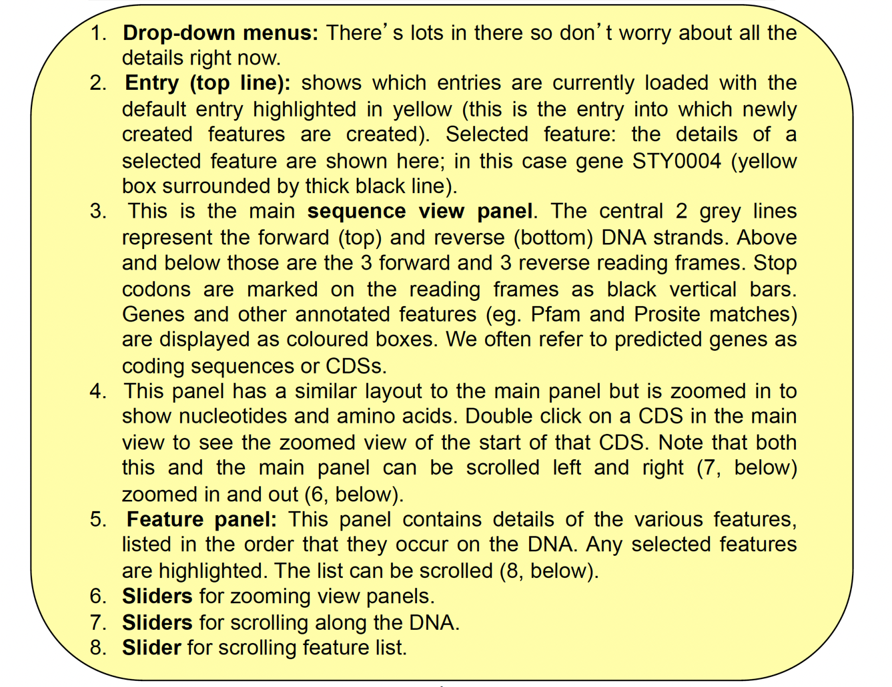

### 4. Getting around in Artemis

There are three main ways of getting to a particular DNA region in Artemis:

-the Goto drop-down menu  

-the Navigator and  

-the Feature Selector (which we will use in Part IV)  

The best method depends on what you’re trying to do. Knowing which one to use comes with practice.

#### 4.1 The “Goto” menu

The functions on this menu (below the Navigator option) are shortcuts for getting to locations within a selected feature or for jumping to the start or end of the DNA sequence. This is really intuitive so give it a try!

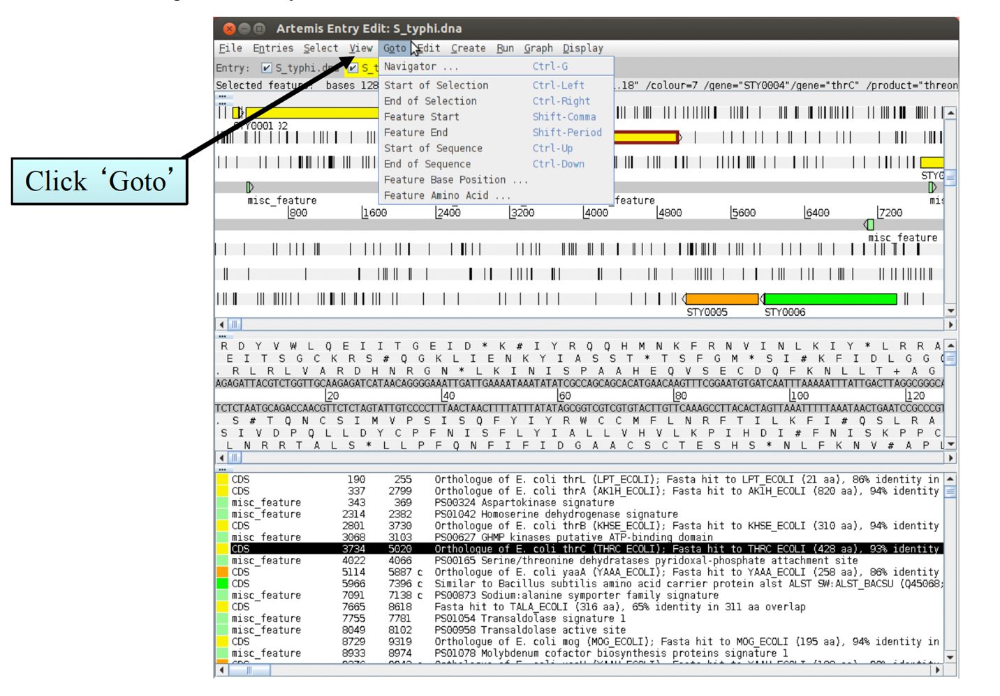

It may seem that ‘Goto’ ‘Start of Selection’ and ‘Goto’ ‘Feature Start’ do the same thing. Well they do if you have a feature selected but ‘Goto’ ‘Start of Selection’ will also work for a region which you have selected by click-dragging in the main window.

1\. Zoom out and highlight a large sequence region by clicking the left mouse button and dragging the cursor. Then, navigate to the start and end of the selected region.

2\. Choose a CDS and navigate to its start and end points.

3\. Navigate to the start and end of the entire genome sequence.

4\. Select a CDS and locate a specific nucleotide or amino acid of your choice within it.

5\. Highlight a region, then right-click and select ‘Zoom to Selection’ from the menu.

#### 4.2 Navigator

The Navigator panel is fairly intuitive so open it up and give it a try.

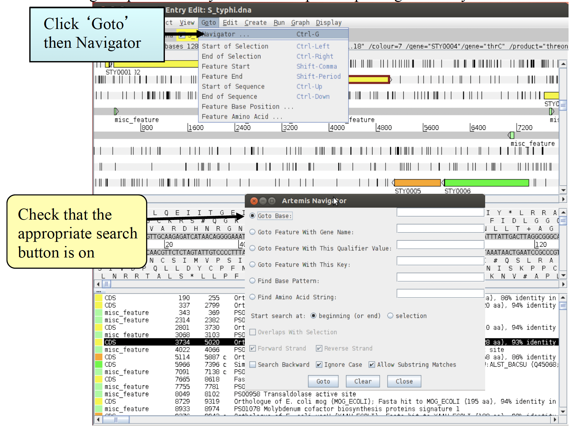

1\. Pick a number between 1 and 4,791,961 and navigate to that base. Notice how the horizontal slider cursors adjust accordingly.

2\. Search for your favourite gene name. If it’s not present, try using a term like “fts.”

3\. Use the “Goto Feature With This Key” option to search all qualifiers for a specific term. For example, searching for “pseudogene” will navigate to the next feature containing this term. Repeatedly clicking the “Goto” button will take you sequentially through all pseudogenes in chromosome order.

4\. Search for tRNA genes by typing “tRNA” in the “Goto Feature With This Key” field.

5\. Search for amino acid consensus sequences, real or hypothetical, using “X”s as placeholders. The search includes all six reading frames, regardless of whether they encode amino acids.

Artemis offers many additional features that we won’t have time to cover in detail. Before proceeding to the next section, take a moment to explore the menus. Most options should be intuitive and straightforward to understand.

## Artemis Exercise 2

This part of the tutorial uses the sequence files you have already loaded into Artemis in Exercise 1. Using your preferred navigation method, move to the genomic region between 670704 and 673340 on the DNA sequence. This region corresponds to the *gyrA* locus, which encodes the DNA gyrase subunit A, a key target of fluoroquinolone antibiotics. You can use the Navigator tool, as described earlier, to jump directly to this position. Once you arrive, your Artemis window should look similar to the example below (you may need to adjust the zoom settings).

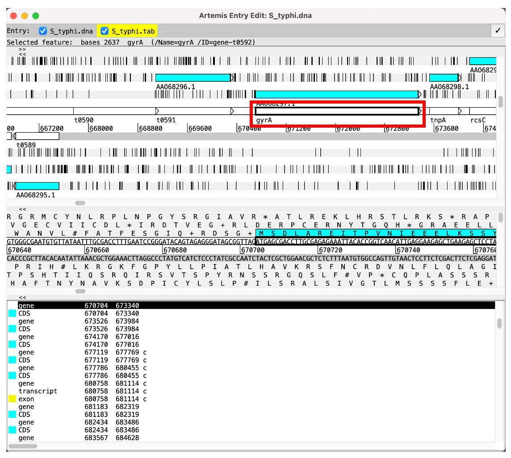

Once you have located this region, explore some of the available information:

### Annotation

Click on a specific feature to view the associated annotation. For instance, select a CDS (or any other feature), go to the ‘Edit’ menu, and choose ‘Selected Feature in Editor.’ A window will open displaying all the annotations related to that CDS. This information follows the format required for submission to the EMBL database.

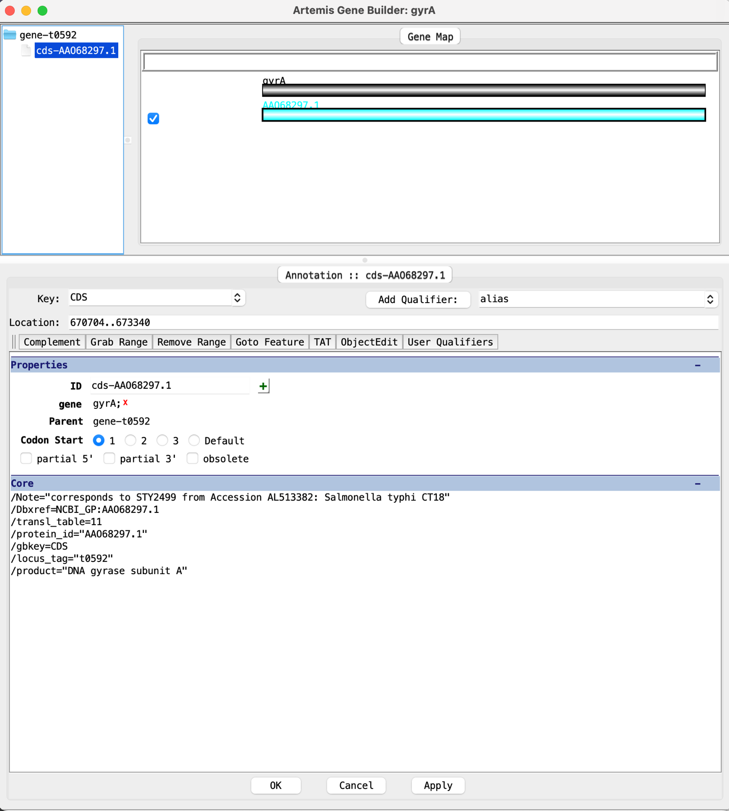

### Viewing Amino Acid or Protein Sequence

Navigate to the ‘View’ menu, where you’ll find several options for displaying the bases or amino acids of the selected feature. You can choose between EMBL format (View -\> Selection) or FASTA format (View -\> Bases or View -\> Amino Acids). This is particularly helpful when using external programs, such as web-based tools, that require copying and pasting sequences.

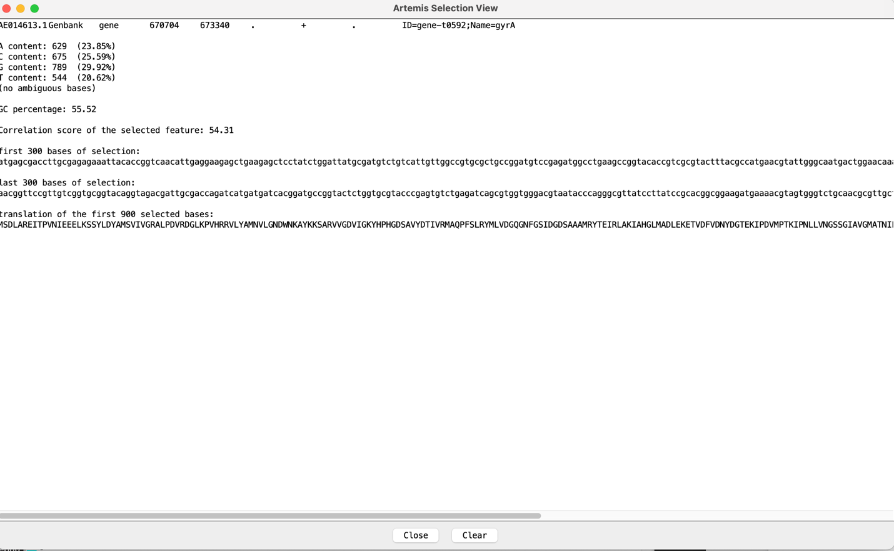

### Plots/Graphs

To view feature plots, select a CDS feature, then go to ‘View’ and click on ‘Feature Plots.’ A window will appear, showing plots that predict the hydrophobicity, hydrophilicity, and coiled-coil regions of the protein product from the selected CDS.

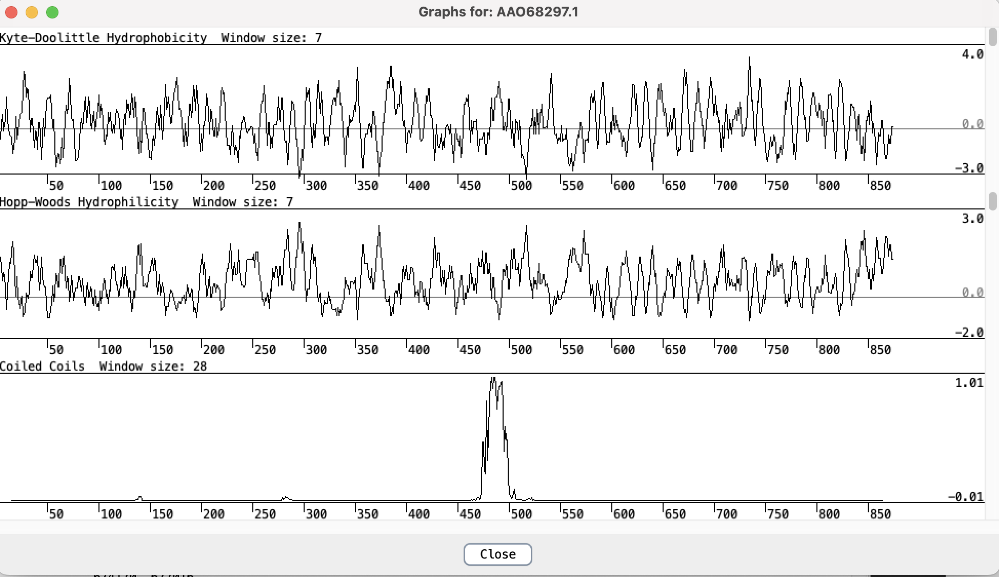

In addition to examining the detailed annotated features, you can also analyse the characteristics of the DNA within the displayed region. This can be achieved by adding various plots to the display, each highlighting different DNA characteristics. Some plots allow you to explore the protein-coding potential of translation frames within the DNA, while others, such as the GC frame plot, can help identify horizontally acquired DNA.

### To view the graphs

Click on the ‘Graph’ menu to see all those available and then tick the box for ‘GC Content (%)’. To adjust the smoothing of the graph you change the window size over which the points on the graph are calculated, using the slider shown below.

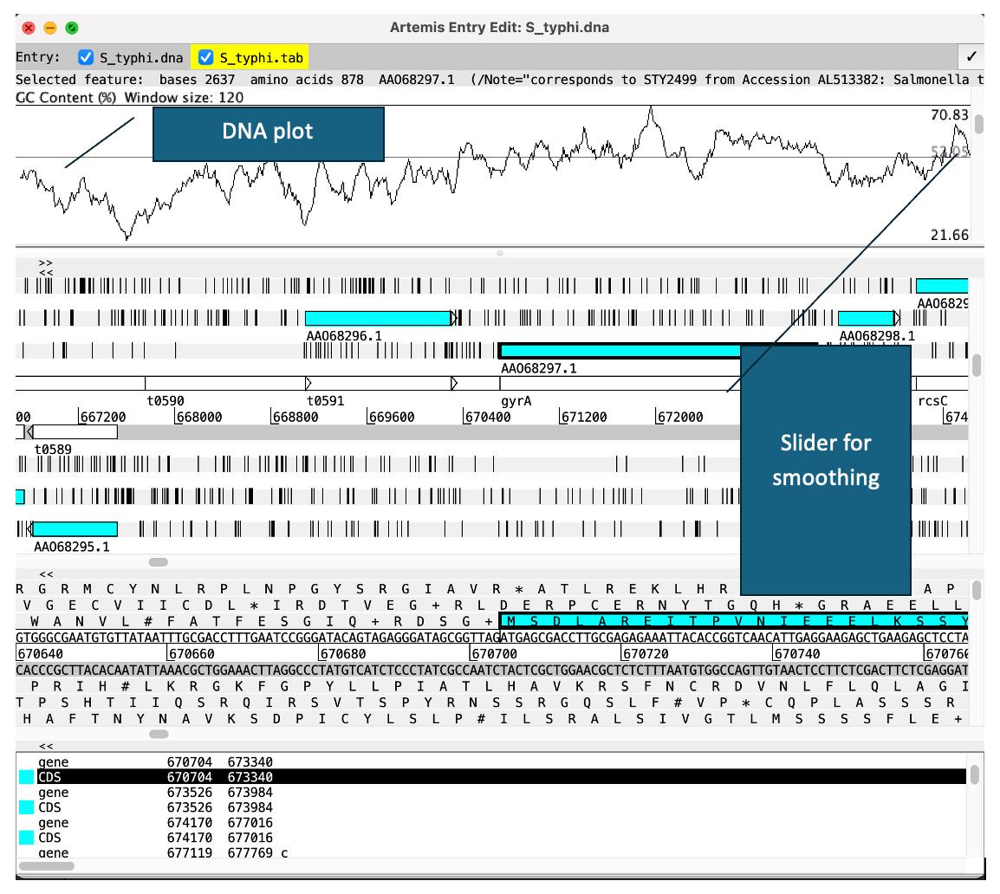

Observe how the plot shows a significant deviation around the region you are currently viewing. To better understand the anomaly, scroll left and right to move the genome view around this region. The unusual nucleotide content in this area suggests the presence of laterally acquired DNA that has been inserted into the genome.

In addition to examining the characteristics of small genome regions, you can zoom out to observe the features of the entire genome. To do this, use the sliders shown above. However, be cautious when zooming out quickly with all features displayed, as it may cause the computer to temporarily freeze. Continue reading for instructions on how to zoom out.

1\. To speed up the process and make the view clearer, disable stop codons by right-clicking in the main view panel. A menu will appear with the option to deselect ‘Stop Codons’ (as shown below).

2\. You will also need to temporarily remove all annotated features from the Artemis display window. If you leave them on, they will be too small to see when zoomed out to show the entire genome. To remove the annotations, click on the S_typhi.tab entry button on the grey entry line of the Artemis window shown above.

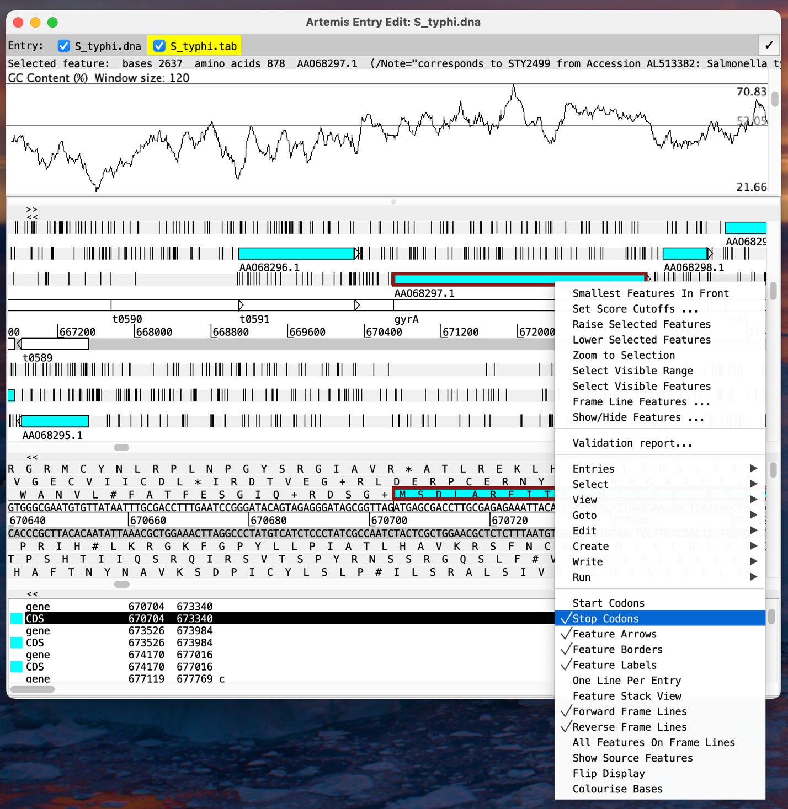

3\. A final tip is to adjust the scaling for each graph before zooming out. This will increase the maximum window size over which a single point is calculated for each plot. To adjust the scaling, right-click on a specific graph window. A menu will appear with the option “Set the Window Size” (as shown above). Set the window size to ‘20000’. Repeat this step for each graph displayed (if an error message appears, click continue).

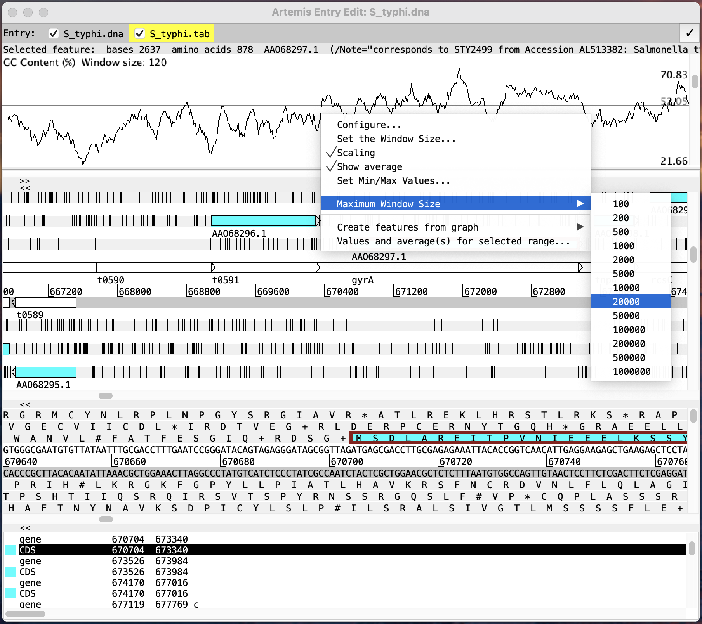

4\. You are now ready to zoom out by dragging or clicking the slider below. Once you have fully zoomed out to view the entire genome, adjust the smoothing of the graphs using the vertical graph sliders as before to achieve a similar view to the one shown below.

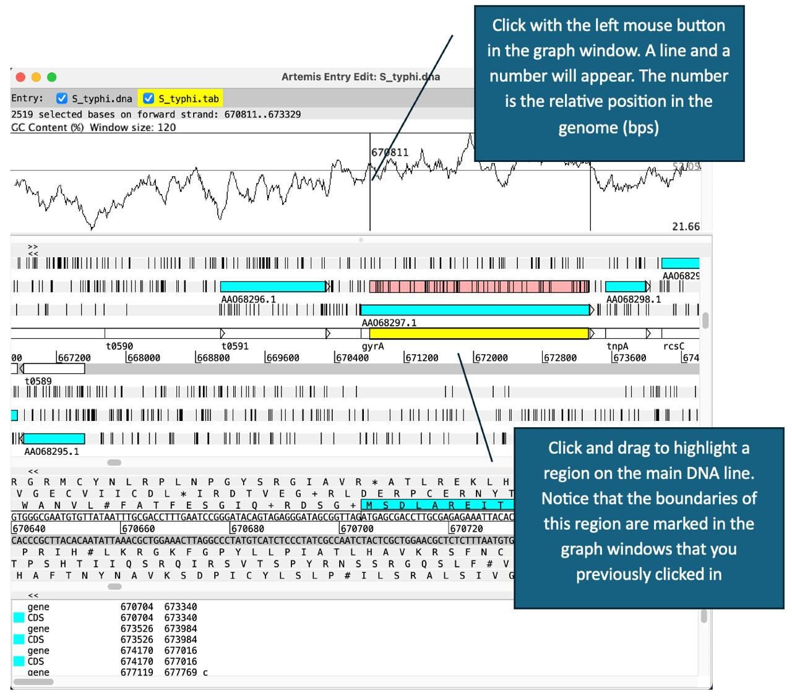

## Artemis Exercise 3

This exercise will guide you through performing NCBI database searches and provide an initial understanding of gene annotation. You will focus on the gene *gyrA*, Use one of the methods you have learned to locate this gene.

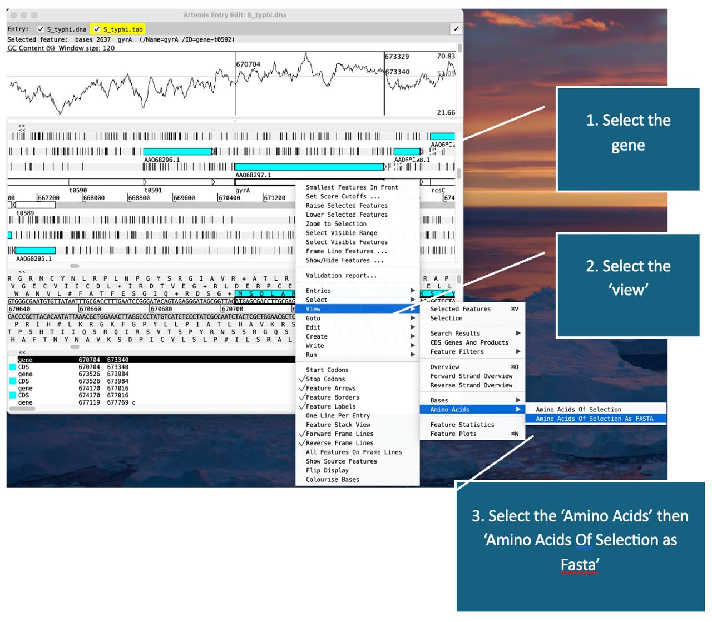

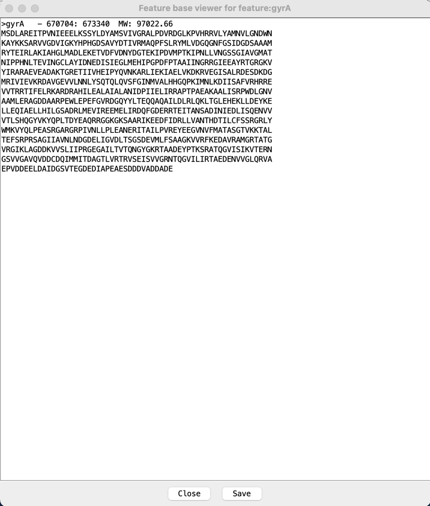

BLAST (Basic Local Alignment Search Tool) is a widely used algorithm for comparing nucleotide or protein sequences against databases to find regions of similarity. It helps identify homologous sequences, predict functions, and analyze evolutionary relationships. BLASTX is a variant of BLAST that translates a nucleotide sequence into all six possible reading frames (three on each strand) and compares the resulting protein sequences against a protein database. This is particularly useful when working with unannotated nucleotide sequences, as it helps detect protein-coding genes, even in cases where the correct reading frame is unknown.

By integrating BLAST and BLASTP with genome visualization tools such as Artemis, researchers can rapidly identify the location, context, and sequence variation of homologous genes within a genome. This approach enables direct inspection of gene neighbourhoods, mutations, and structural features, providing a clearer understanding of functional relevance. It also streamlines comparative genomics workflows by linking alignment results to visual interpretation, improving gene annotation accuracy and supporting downstream analyses.

Copy the base sequence and open the NCBI blast webpage: [*https://blast.ncbi.nlm.nih.gov/Blast.cgi*](https://blast.ncbi.nlm.nih.gov/Blast.cgi)

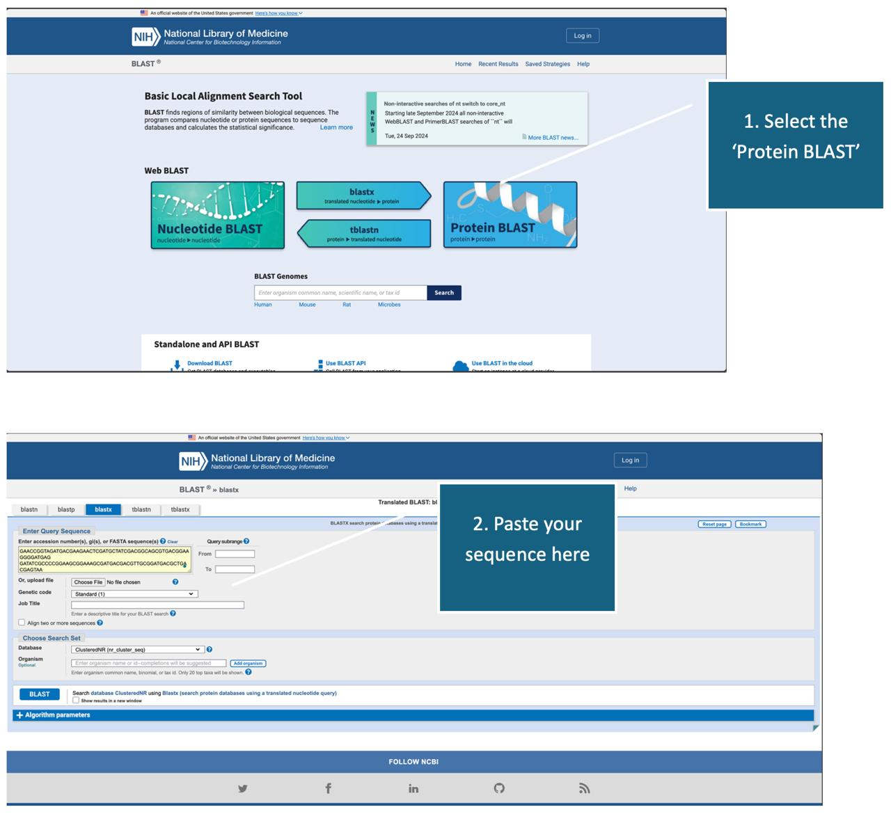

Click BLAST and wait for a while…

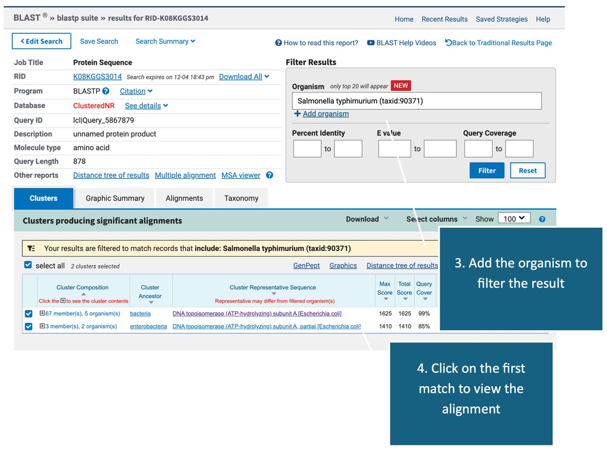

NCBI BLASTP alignment output compares a protein query sequence to sequences in a database and highlights similarities. In the alignment:

1.  Letters represent amino acids in the query (top) and subject/target (bottom) sequences.

2.  A “+” (plus sign) indicates a conservative substitution, meaning the amino acids are different but share similar biochemical properties (e.g., both hydrophobic), so the substitution is likely functionally tolerated.

3.  A gap (– or space) represents an insertion or deletion event that occurs in one of the sequences relative to the other. Gaps reduce alignment scores because they indicate structural differences.

4.  Identities show exact matching residues, while positives include identities + conservative substitutions (those marked with “+”).

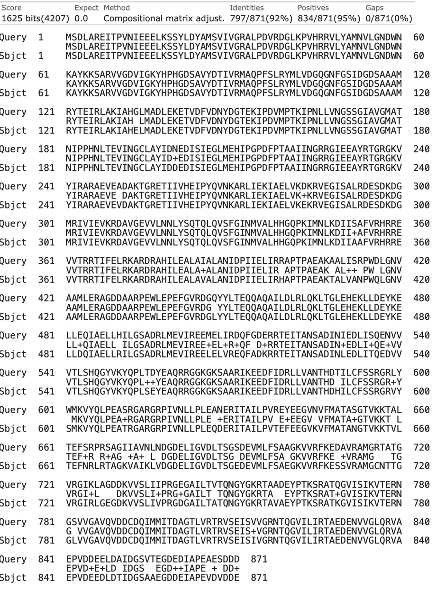

## Artemis Exercise 4

Now go to position 1334484. The next region we are looking at is defined as a Salmonella pathogenicity island (SPI). SPI-2, or the major pathogenicity island, is ~21 kb in length. The region you should be looking at is shown below and is a classical example of a Salmonella pathogenicity island (SPI). The definitions of what constitutes a pathogenicity island are quite diverse. However, below is a list of characteristics which are commonly seen within these regions.

1\. Often inserted alongside stable RNAs

2\. Atypical G+C contents.

3\. Carry virulence-related functions

4\. Often carry genes encoding transposase or integrase-like proteins

5\. Unstable and self-mobilisable

6\. Limited phylogenetic distribution

Have a look in and around this region and look for some of these features.

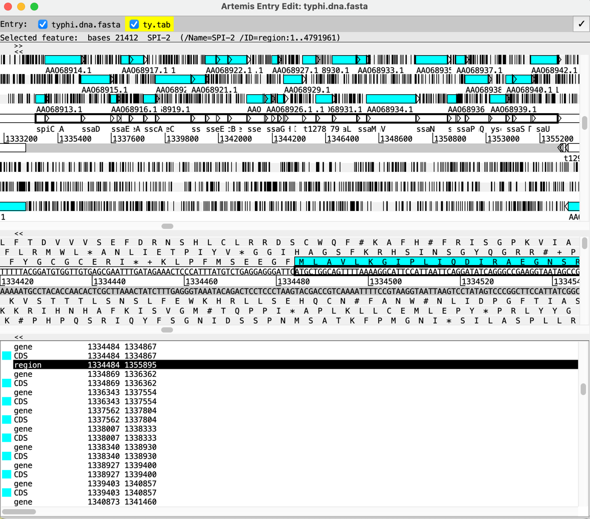

We are going to extract this region from the whole genome sequence and perform some more detailed analysis on it. We will aim to write and save new EMBL format files which will include just the annotations and DNA for this region.

Follow the numbers on the next page to complete the task.

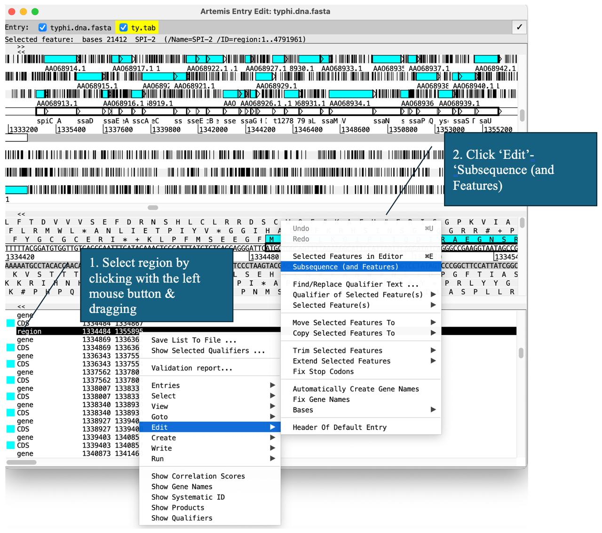

A new Artemis window will appear displaying only the region that you highlighted

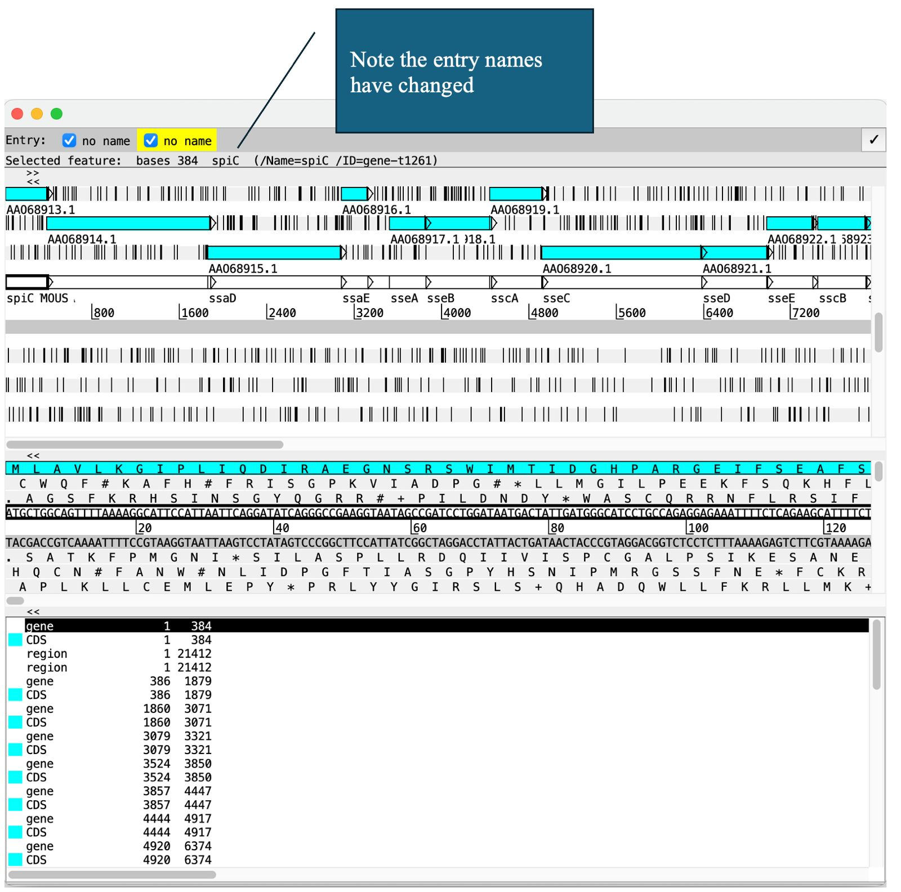

Observe that the two entries in the grey ‘Entry’ line are now labeled as ‘no name.’ These entries contain the same information in the same order as displayed in the original Artemis window, but they lack assigned ‘Entry’ names. Since the sub-sequence is being viewed in a new Artemis session, this ensures that the original files (S_typhi.dna and S_typhi.tab) remain unaltered.

We will save the new files with appropriate names to ensure clarity. To do this, open the ‘File’ menu, select ‘Save An Entry As,’ and then choose ‘New File.’ A menu will appear listing the available entries, both currently labeled as ‘no name.’ Click on the first entry in the list, and a prompt will appear asking you to name the file. Save this file as spi2.dna.

Repeat the process for the second unnamed entry, saving it as spi2.tab.

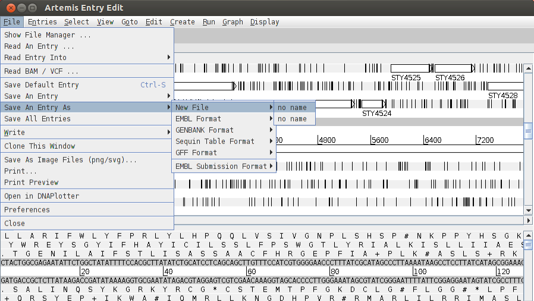

We are going to look at this region in more detail and to attempt to define cluster of *ssa* gene family. The *ssa* (Salmonella pathogenicity island-2 secretion apparatus) gene family is a cluster of genes within the Salmonella pathogenicity island 2 (SPI-2), a key virulence determinant in Salmonella. These genes encode components of a Type III secretion system (T3SS), a specialized molecular apparatus used by Salmonella to translocate effector proteins into host cells. This system plays a crucial role in enabling Salmonella to survive and replicate within host macrophages by modulating host cell functions, promoting immune evasion, and facilitating systemic infection. Key genes in this family, such as *ssaV, ssaG*, and *ssaH*, are essential for the structural integrity and functionality of the T3SS.

First we need to create a new entry (click ‘Create’ then ‘New Entry’). Another entry will appear on the entry line called, you guessed it, ‘no name’. We will eventually copy all our *ssa* genes into here.

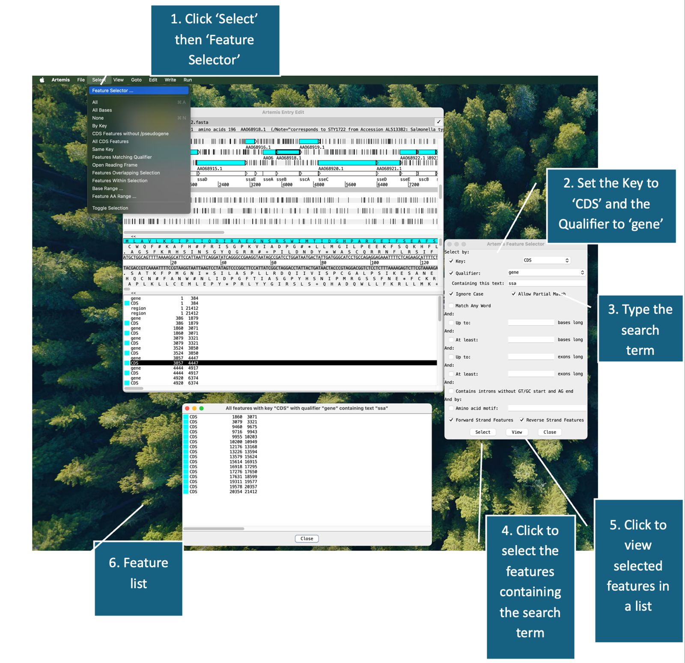

The genes listed in (6) only fit your selection criteria. They can be copied or cut / moved in to a new entry so we can view them in isolation from the rest of the information within spi2.tab.

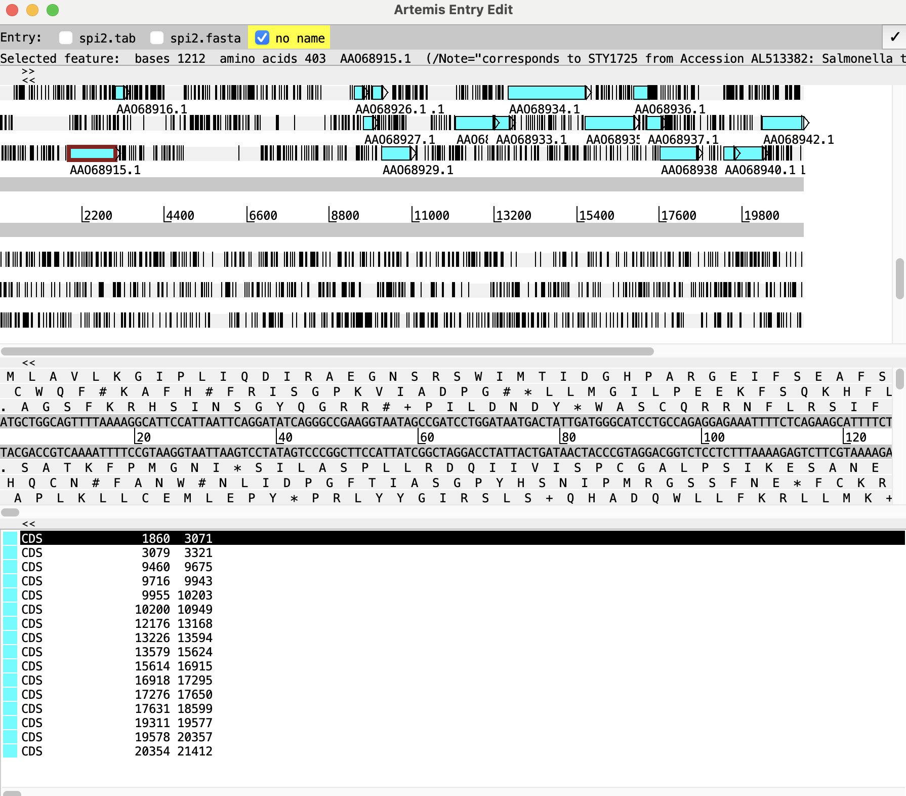

The final step is to save the spi2 files in EMBL submission format and create a merged annotation and sequence file in the same format. In Artemis, copy the annotation features from the ‘.tab’ file into the ‘.dna’ file. Once this is done, save the combined entry in EMBL format. If error messages appear during this process, they can be ignored, as not all entries are compliant with EMBL database requirements.

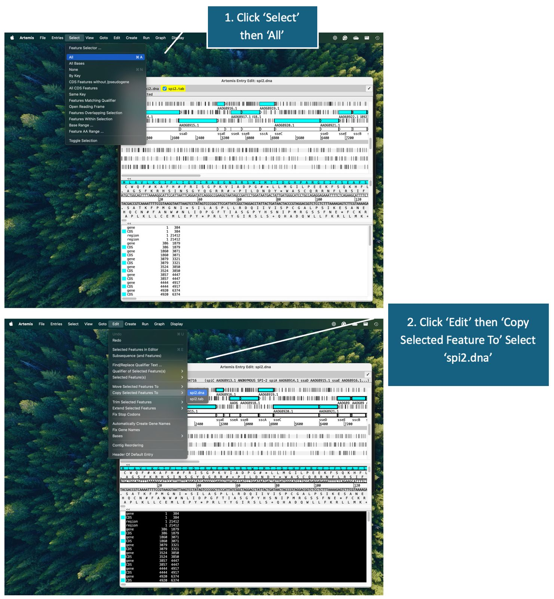


Now open the EMBL format file that you have just created in Artemis.

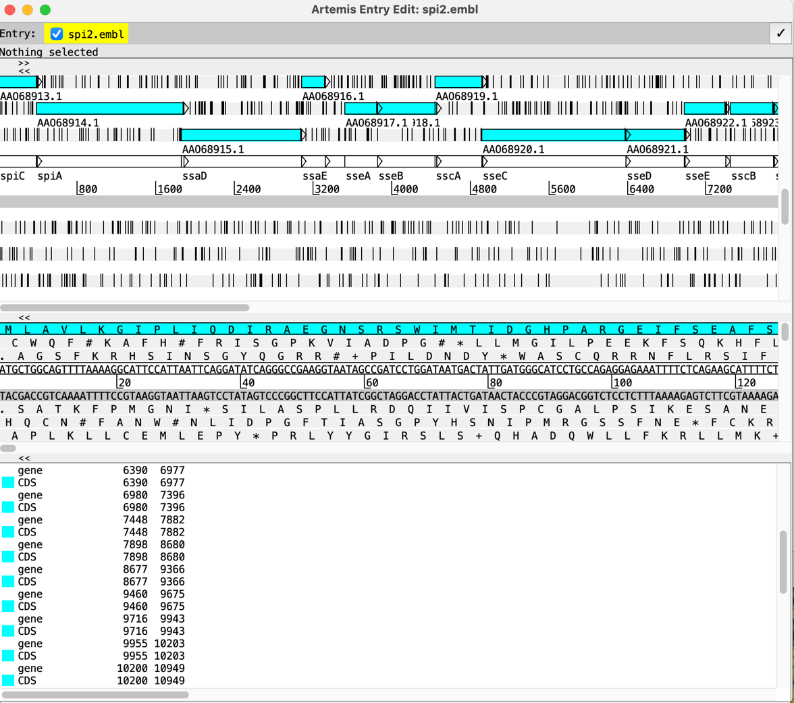

