**Bandage**

Bandage (short for Bioinformatics Application for Navigating De novo Assembly Graphs Easily) is a user-friendly tool for visualising and exploring genome assembly graphs. Bandage makes these graphs accessible, allowing you to visually inspect the structure of your assembly. This can help you understand, debug, and improve your results. You can zoom, pan, customise the graph view, search for specific sequences, extract regions of interest, and more—all in an interactive interface.

To enable Bandage’s sequence search functionality (e.g., using the “Create BLAST” tool), you need to have BLAST+ installed on your system. Bandage relies on BLAST to perform local sequence alignment within the assembly graph. You can install BLAST in a different way for different systems:

BLAST Installation Steps:

1.  Open the website: <https://ftp.ncbi.nlm.nih.gov/blast/executables/blast+/2.2.31/>

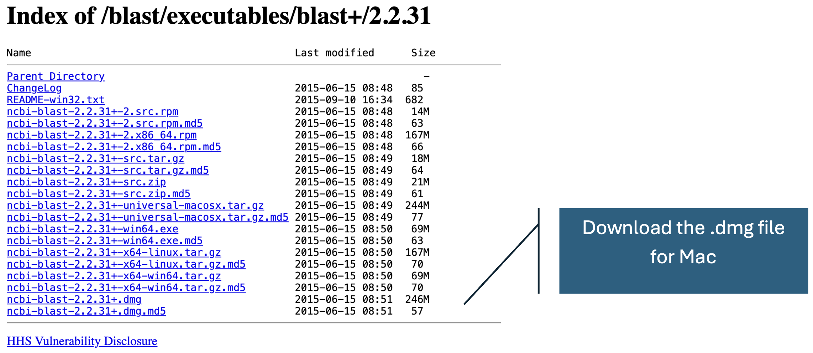

2\. Download the version that matches your computer’s configuration

3\. Double-click the software package and follow the installation instructions

Bandage Installation Steps:

1\. Open the website: <https://github.com/rrwick/Bandage>

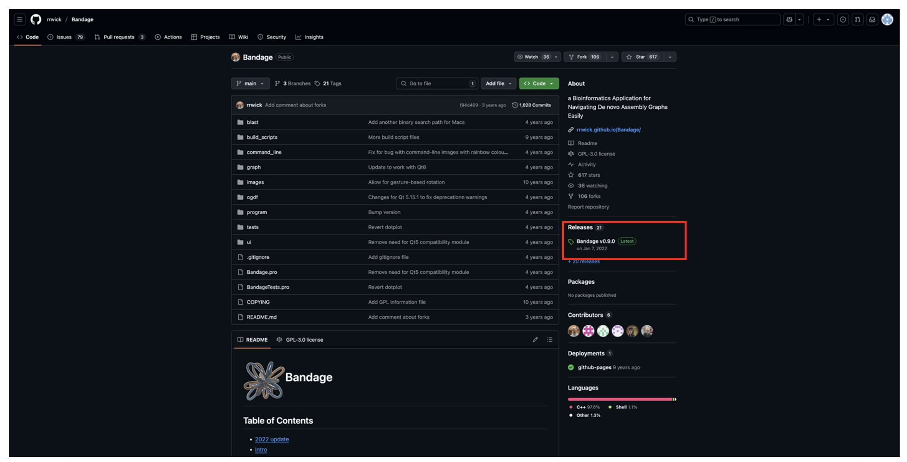

2\. Download the version matches your computer’s configuration

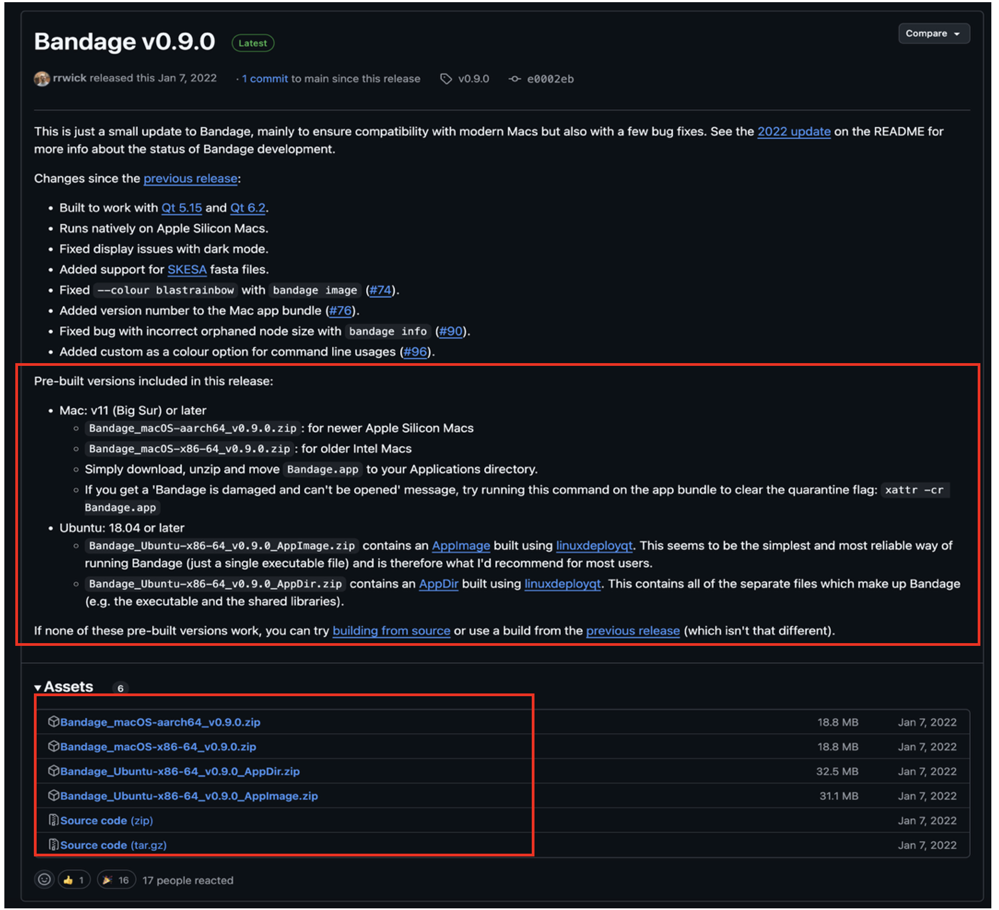

3\. Unzip the file and move _Bandage.app_ to your Applications directory.

4\. If you get a 'Bandage is damaged and can't be opened' message, try running this command on the Terminal to clear the quarantine flag: _xattr -cr /Applications/Bandage.app_

**Aliview**

AliView is a fast and user-friendly alignment viewer and editor designed to handle large multiple sequence alignments efficiently. It supports a wide range of alignment formats, including FASTA, PHYLIP, NEXUS, and Clustal, making it a versatile tool for exploring genomic data.

Installation Steps:

1\. Open the website: <http://www.ormbunkar.se/aliview/>

2\. Download the installation package corresponding to your system

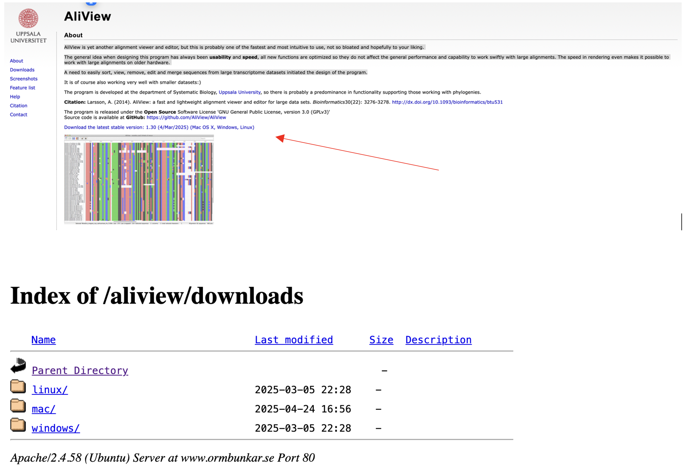

3\. Unzip the file and follow the installation instructions

**Genome Assembly and Variant Calling**

Genome assembly and variant calling are central to genomic analysis, often working together within the same research pipeline. Genome assembly involves reconstructing the complete DNA sequence of an organism from raw sequencing reads, particularly important when a reference genome is unavailable or incomplete. The resulting assembly can serve as a high-quality reference for further analyses. Variant calling, on the other hand, focuses on identifying genetic differences—such as SNPs, insertions, deletions, and structural variants—between individuals or strains. This is typically achieved by mapping sequencing reads to a reference genome. The accuracy and completeness of the reference, whether publicly available or newly assembled, directly influence the reliability of variant detection. In this tutorial, we explore both genome assembly and variant calling, illustrating how they complement each other in genomic studies. You’ll learn how to construct genome assemblies and use them or existing references to detect variants from read alignment, providing insights into genome structure and diversity.

**Introduction to Genome Assembly**

Recent advances in DNA sequencing technology have revolutionised the study of organisms at the genomic and transcriptomic levels. These improvements have enabled detailed analyses of genomic variation, gene identification, structural rearrangements, and population-scale comparisons. In this module, we introduce the principles of genome assembly, with a focus on combining modern sequencing data and assembly strategies to reconstruct accurate genome structures.

Previously, most sequencing data came from short-read technologies such as the Illumina Genome Analyzer II, producing large volumes of short (typically 35–150 bp) DNA fragments. Modern Illumina platforms (e.g., NovaSeq, NextSeq) now yield hundreds of gigabases of sequence data in a single run, enabling deep coverage of complex genomes. However, short-read assemblies often result in fragmented genomes with many contigs, due to difficulties resolving repetitive elements longer than individual reads.

To address these limitations, long-read sequencing technologies such as Oxford Nanopore Technologies (ONT) and Pacific Biosciences (PacBio) have emerged. These platforms produce read lengths ranging from several kilobases up to megabases (in the case of ONT), greatly simplifying genome assembly by spanning repetitive regions and structural variants. PacBio’s HiFi reads provide long sequences with high per-base accuracy (~99.9%), while ONT continues to improve in both throughput and accuracy, making it highly suitable for real-time and portable sequencing.

Despite their strengths, long-read technologies can still benefit from integration with short-read data. Hybrid assembly approaches leverage the high accuracy of Illumina reads with the structural resolving power of long reads. The assembly process remains fundamentally about reconstructing full genome sequences from fragmented reads by detecting overlaps and connecting sequences.

This process—genome assembly—involves aligning and ordering these reads into larger structures called contigs and scaffolds. A common computational approach for assembling short reads is to construct de Bruijn graphs, where reads are broken into overlapping subsequences (k-mers), and graph structures help resolve paths representing genomic sequences. Assemblers such as Velvet and ABySS were pioneers in short-read graph-based assembly.

In this module, however, we will focus on tools optimised for hybrid or long-read assembly, particularly Unicycler. Unicycler uses a multi-stage approach that can operate in short-read-only, long-read-only, or hybrid modes, combining the best of both worlds. It integrates accurate short-read contigs with long-read scaffolding to generate highly contiguous, and often complete, bacterial genome assemblies.

**Aims**

By the end of this module, you will understand:

- The differences between short-read and long-read sequencing technologies

- Challenges associated with genome assembly

- Key concepts like contigs and assembly graphs

- How to run and evaluate genome assemblies using Unicycler and Quast

Whether you’re assembling a simple bacterial genome, the principles introduced here will serve as a solid foundation for your bioinformatics practice.

**Background for Unicycler**


Unicycler (<https://github.com/rrwick/Unicycler>) is a powerful and easy-to-use genome assembly pipeline tailored for bacterial genomes, offering flexible support for a range of sequencing data types. It is designed to deliver high-quality assemblies using short reads (Illumina), long reads (Oxford Nanopore or PacBio), or a hybrid of both, making it highly adaptable for different experimental setups.

In short-read-only mode, Unicycler functions as a SPAdes optimiser, producing improved assemblies by refining and resolving assembly graphs. Its real strength lies in hybrid assembly, where it uses the accuracy of Illumina reads to build a backbone and the length of long reads to resolve complex regions and repeats, leading to high-contiguity, low-error assemblies, often with circularised plasmids and chromosomes.

Unicycler is especially suited for plasmid-rich bacterial genomes and performs well even with low-coverage long-read data. It can also resolve highly repetitive genomic regions that are otherwise difficult to assemble using short reads alone. The output includes not just contigs in FASTA format, but also an assembly graph (viewable with tools like Bandage), which provides a clearer view of genome structure, especially when assemblies are not fully complete.

Additional strengths include automated circularisation (removing the need for post-processing tools like Circlator), contamination filtering, and low misassembly rates, all wrapped in a pipeline that typically runs with just a single command.

However, Unicycler is not suitable for eukaryotic or metagenomic datasets, and it assumes that all input reads originate from the same bacterial isolate. Despite not being the fastest assembler, its thoroughness and reliability make it an excellent choice for bacterial genome projects requiring clean, accurate assemblies.

**Start with your first genome assembly**

*Klebsiella pneumoniae* is a clinically significant Gram-negative bacterium, commonly associated with hospital-acquired infections, including pneumonia, bloodstream infections, and urinary tract infections. It is particularly concerning due to its capacity to acquire and disseminate antimicrobial resistance genes, making it a priority pathogen for surveillance and research.

The genome of *K. pneumoniae* typically consists of a ~5–6 Mb circular chromosome and multiple plasmids, many of which carry resistance or virulence factors. The genomic complexity of *K. pneumoniae*, including repetitive elements and plasmid content, makes it an excellent case study for genome assembly and variant analysis. In today’s session, we will use real *K. pneumoniae* sequencing data to explore genome assembly techniques and identify genomic variation, gaining insights into both the technical challenges and biological relevance of genomic analysis in this important pathogen.

Now, log in to IBEX and copy today’s tutorial materials to your scratch folder

```bash
ssh -X <YourUserName>@ilogin.ibex.kaust.edu.sa
cp -r /ibex/project/c2325/B200/Day4_Assembly_Mapping/* /ibex/user/<YourUserName>
ls
```

| HKPR018_1.fq.gz             | Forward reads for Sample HKPR018 within ziped fastq format |
|-----------------------------|------------------------------------------------------------|
| HKPR018_2.fq.gz             | Reverse reads for Sample HKPR018 within ziped fastq format |
| assembly_unicycler_short.sh | Script for running Unicycler                               |

View the script with your prefer editor, for example:

```bash
nano assembly_unicycler_short.sh
```

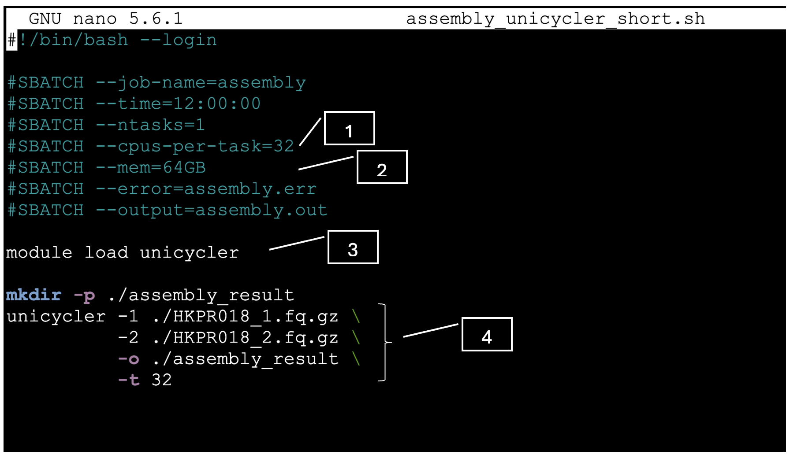


1\. Requesting 32 threads for this genome assembly job. Genome assembly is highly computationally demanding, and using more threads should accelerate the process. However, it may still encounter bottlenecks. Try adjusting this option and observe how it affects the assembly runtime.

2\. Request for 64 GB RAM for this computation job.

3\. Load the software package Unicycler

4\. Command for running Unicycler:

    -1 FASTQ file of forward reads in each pair

    -2 FASTQ file of reverse reads in each pair

    -o Output directory

    -t Number of threads used (matched above number we requested)

Close the text editor and submit your first genome assembly job

```bash
sbatch assembly_unicycler_short.sh
```

The running time may take up to 10 minutes, be patient!

Once the job has been finished, let’s view the output folder:

```bash
ll -lh
```

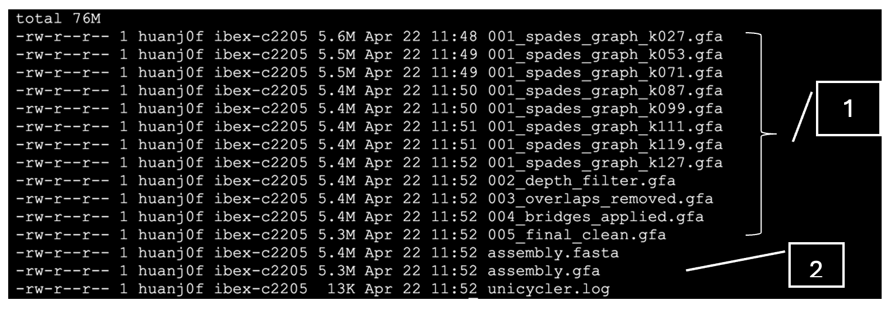

1\.

_\*\_spades_graph_k\*.gfa_: unaltered SPAdes assembly graphs at each k-mer size

_\*\_depth_filter.gfa_: best SPAdes short-read assembly graph after low-depth contigs have been removed and multiplicity determination

_\*\_overlaps_removed.gfa_: overlap-free version of the best SPAdes graph, with some more graph clean-up

_\*\_bridges_applied.gfa_: bridges applied, before any cleaning or merging

_\*\_cleaned.gfa_: redundant contigs removed from the graph

We won’t go in-depth for these files, but if you want to know more about gfa file format: <https://github.com/GFA-spec/GFA-spec/blob/master/GFA1.md>

2\.

_assembly.fasta_: final assembly in FASTA format (same sequences as in assembly.gfa except for very short contigs)

_unicycler.log_: Unicycler log file (same info as was printed to stdout)

**Evaluate your genome assembly**


After generating a genome assembly, it is essential to assess its quality before proceeding with downstream analyses. Assembly evaluation provides insight into how complete, accurate, and contiguous the reconstructed genome is, helping to identify potential issues such as fragmentation, misassemblies, or missing regions.

Key metrics used to evaluate assemblies include the number of contigs, total assembly length, N50 (a measure of contiguity), GC content, and alignment to a reference genome when available. These statistics help determine whether the assembly sufficiently represents the organism’s genome and whether further refinement is needed.

QUAST (Quality Assessment Tool for Genome Assemblies) is a widely used software tool that automates this evaluation process. It generates detailed summary reports and plots, comparing assemblies to a reference genome if provided. QUAST can highlight misassembled regions, estimate genome completeness, and compare multiple assemblies side-by-side—making it an indispensable tool for genome assembly projects. In this session, we’ll use QUAST to assess the quality of our *K. pneumoniae* assemblies.

View the script with your prefer editor:

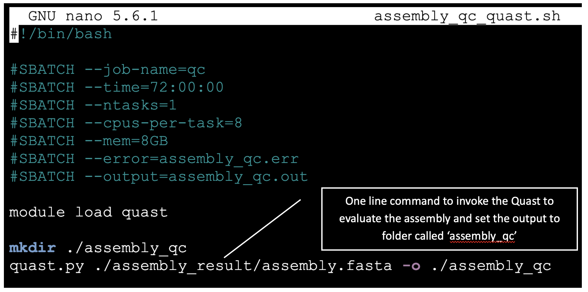

After a few minutes, it should finish running, let’s view the result. The summary table is in report.txt

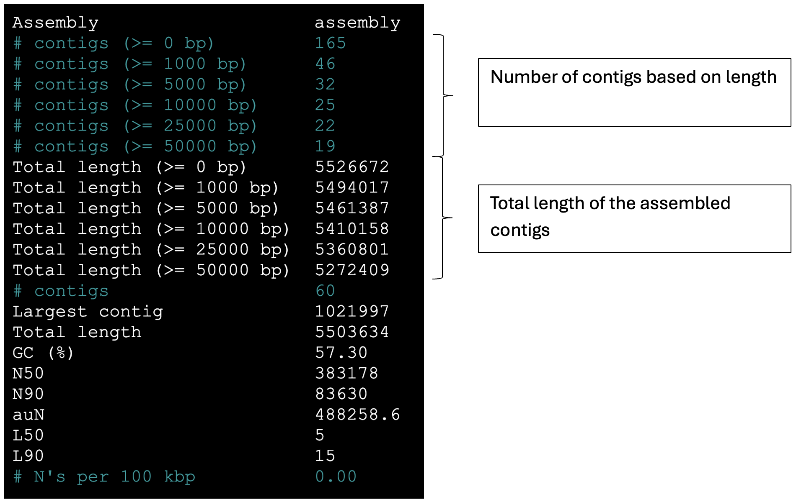

We focuse on the few key metrics: Number of large contigs (i.e., longer than 500 bp) and total length of them; Length of the largest contig; N50 (length of a contig, such that all the contigs of at least the same length together cover at least 50% of the assembly). There are no strict or universal thresholds for these genome assembly metrics. This is because acceptable values can vary depending on the organism, the sequencing technology used, and the intended downstream analysis. Instead of relying on fixed cutoffs, it’s often more meaningful to compare assembly statistics across a batch of samples processed under similar conditions. This comparative approach helps identify outliers or problematic assemblies relative to the group.

Additionally, assemblies generated from short reads alone (e.g., Illumina) often remain fragmented, particularly in repetitive or plasmid-rich genomes like Klebsiella pneumoniae. However, the incorporation of long-read sequencing technologies (such as Oxford Nanopore or PacBio) can significantly improve assembly quality by spanning repeats and resolving complex regions. As long-read data becomes more available, we can expect higher contiguity, fewer contigs, and more complete assemblies, bringing us closer to accurate, closed bacterial genomes.

**Improve your assembly with ONT (Oxford Nanopore) data**

If your short-read assembly has too many contigs, unresolved repeats, or broken plasmids—This is where long reads come in. Technologies like Oxford Nanopore produce much longer reads that can bridge tricky regions, resolve repeats, and help us piece together a far more complete genome. Even if your long-read data isn’t perfect or ultra-deep, combining it with Illumina reads in a hybrid assembly can make a huge difference.

In this part of the session, we’ll see just how powerful long reads can be. We’ll feed both short and long reads into Unicycler, and watch it clean up the assembly—fewer contigs and a fully circularised chromosome and plasmid.

See the files and the hybrid assembly code in this part:

```bash
ls
```

| HKPR018_1.fq.gz              | Forward reads for Sample HKPR018 within ziped fastq format |
|------------------------------|------------------------------------------------------------|
| HKPR018_2.fq.gz              | Reverse reads for Sample HKPR018 within ziped fastq format |
| HKPR018_L.fastq.gz           | ONT reads for Sample HKPR018 within ziped fastq format     |
| assembly_unicycler_hybrid.sh | Script for conducting hybrid assembly                      |

View the script with your prefer editor:

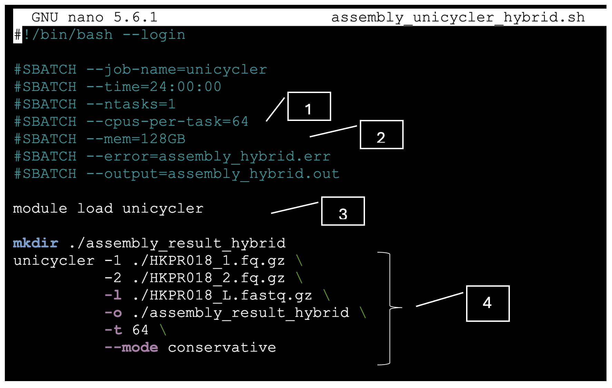

1\. Requesting 64 threads for hybrid genome assembly job. With the long reads, the reads alignment is more computationally demanding. We using more threads should accelerate the process.

2\. Request for 128 GB RAM for this computation job.

3\. Load the software package Unicycler

4\. Command for running Unicycler:

    -1 FASTQ file of forward reads in each pair

    -2 FASTQ file of reverse reads in each pair

    -l FASTQ file of long reads

    -o Output directory

    -t Number of threads used (matched above number we requested)

    --mode Bridging mode

        conservative = smaller contigs, lowest misassembly rate

        normal = moderate contig size and misassembly rate

        bold = longest contigs, higher misassembly rate


Unicycler has three assembly modes you can choose from: conservative, normal (default), and bold—set using the --mode option. Each mode balances two things: how complete the assembly is and how accurate it is.

- Conservative mode avoids taking risks, so your assembly is less likely to have errors, but it might be incomplete.

- Bold mode takes more chances to try and finish the assembly. It’s more likely to give you a complete genome, but there’s a higher chance of small mistakes.

- Normal mode sits in between—it tries to give a good balance of completeness and accuracy.

Choose the mode based on your needs. If having a very accurate structure is most important, go with conservative. In our case we chose the conservative mode, to avoid any misassembly the reads. In future plasmidome analysis, we aim for a accuracy plasmid stuructue.

Close the text editor and submit your hybrid genome assembly job

```bash
sbatch assembly_unicycler_hybrid.sh
```

The running time may take up to **20** minutes, longer time than only short reads.

Once the job has been finished, view the output folder and make sure the final assembly file (assembly.fasta) is in your output folder. The folder sturcture remain same with the short reads only assembly.

Change the code for ‘assembly_qc.sh’ as below and run Quast for the hybrid asssembly.

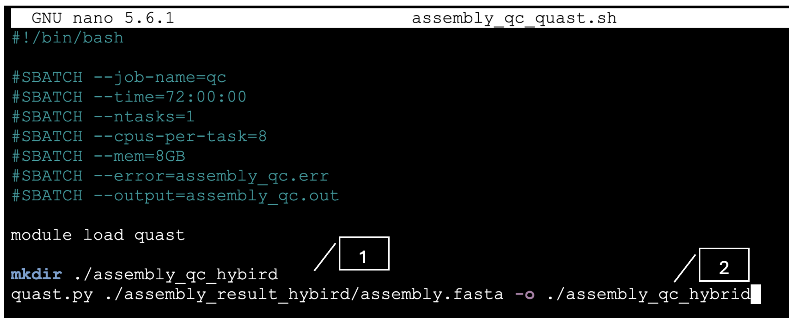

1\. Create a new folder to store the QUAST output for hybrid assembly. This will help keep your results organized and separate from other assemblies.

2\. Run QUAST using your hybrid assembly file as the input, and specify the new folder as the output directory. Make sure to replace the input file with your hybrid assembly FASTA file, and direct the results to the folder you just created.

Sbatch the code and wait for it finish running. Let’s view the new Quast output:

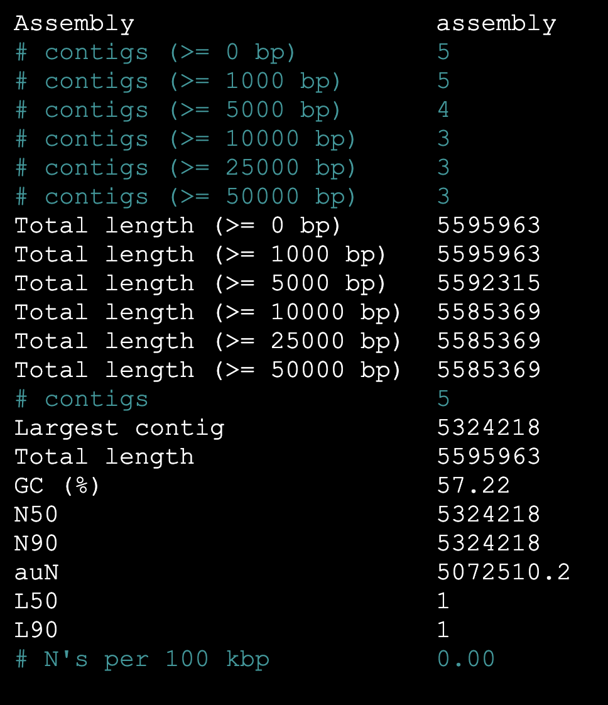

By comparing the hybrid assembly results with the short-read-only assembly, you’ll notice a significant reduction in the number of contigs. This indicates a much higher level of continuity in the genome assembly. Additionally, the N50 value has increased by over 12-fold, reflecting the assembly’s improved quality and longer contiguous sequences.

To have a intutive view of the assembly quality improvement, we can view the assembly file through Bandage


Bandage (short for Bioinformatics Application for Navigating De novo Assembly Graphs Easily) is a user-friendly tool for visualizing and exploring genome assembly graphs. Bandage makes these graphs accessible, allowing you to visually inspect the structure of your assembly. This can help you understand, debug, and improve your results. You can zoom, pan, customise the graph view, search for specific sequences, extract regions of interest, and more—all in an interactive interface.

Download your assembly to your local machine and open the bandage:

To download a file from a remote server to your local computer, you can use the scp (secure copy) command on your own computer (NOT IBEX):

Open the terminal on your computer and try below command:

```bash
scp <YourUserName>@ilogin.ibex.kaust.edu.sa:/ibex/user/<YourUserName>/path/for/your /assembly /path/to/local/destination
```

Load the assembly file to Bandge:

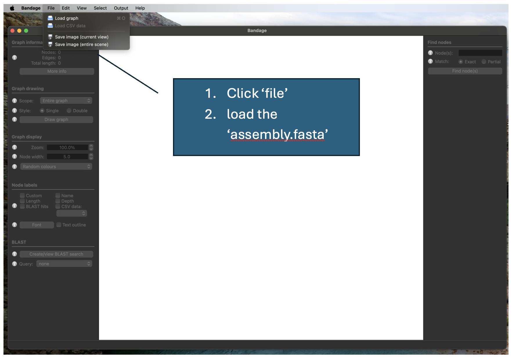

Let’s view the short read assembly first:

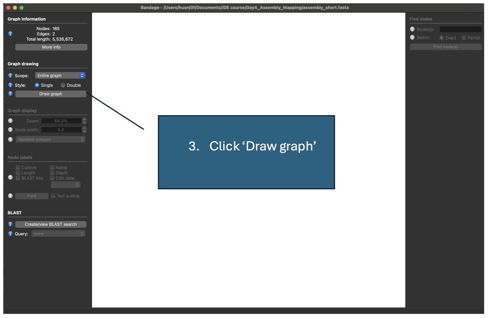

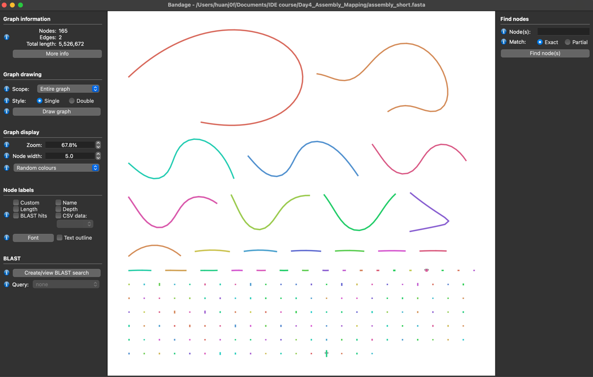

You can see that the fragmented genome assembly contains over a hundred contigs, making it difficult to accurately resolve the chromosome or plasmid structures. However, if you view the hybrid assembly file in Bandage, the graph appears more contiguous and easier to interpret. Note that Bandage assigns colors to contigs randomly each time a file is opened, so the colors in your view may differ from those shown in this tutorial figure.

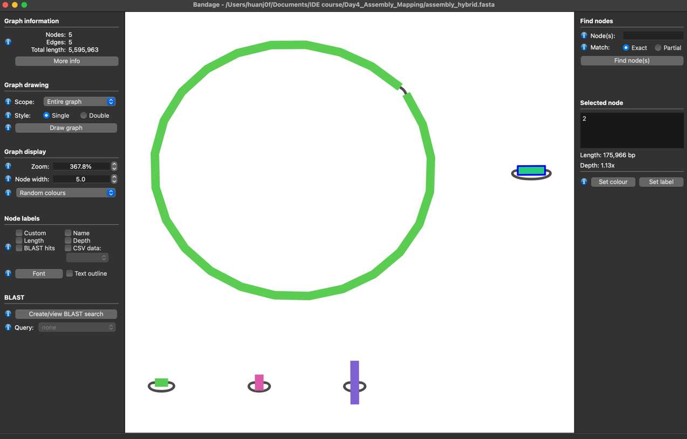

You can see the contigs are well circularised and structured for the bacterial genome. How can we analyse these contigs and characterise them as belonging to chromosomes or plasmids? We will discuss this part on Day 8.

**Introduction to reads mapping and variant calling**

Read mapping is a key step in genome analysis where sequencing reads are aligned to a reference genome to identify similarities and differences. This process helps us detect genetic variations within a sample, especially single nucleotide polymorphisms (SNPs)—single base changes in the DNA sequence.

By aligning reads from a sequencing reads to a known reference genome, we can pinpoint the exact locations where the sample genome differs. These SNPs serve as powerful genetic markers for studying evolutionary relationships, epidemiological tracking, and functional changes in the genome.

Accurate SNP detection depends on high-quality read alignment and sufficient sequencing coverage. In this session, we will map sequencing reads to the *K. pneumoniae* reference genome and perform SNP calling, providing insights into genomic variation that can inform further research into antimicrobial resistance, virulence, and population structure.

**Aims**

By the end of this module, you will understand:

- Understand the concept of read mapping and how it allows comparison between sequencing reads and a reference genome to detect genetic differences.

- Learn how to perform SNP calling from mapped reads to identify single nucleotide variations in Klebsiella pneumoniae isolates.

**Introduction to Snippy**

Snippy (<https://github.com/tseemann/snippy>) is a fast and user-friendly tool designed for haploid variant calling and core genome alignment, particularly well-suited for bacterial genomes. Developed by Torsten Seemann, Snippy compares sequencing reads from your sample against a single reference genome to identify single nucleotide polymorphisms (SNPs) as well as small insertions and deletions (indels). Snippy is optimised for speed and scalability making it ideal for high-throughput environments. It outputs a comprehensive and standardised set of results in a single folder, making downstream processing simple and consistent.

In this session, we’ll use Snippy to explore genomic variation in Klebsiella pneumoniae and prepare data for comparative and evolutionary analysis.

**Mapping reads against the reference genome**

Here we use the NCBI RefSeq of *Klebsiella pneumoniae* Ecl8, a Reference Strain for Targeted Genetic Manipulation (acc: HF536482.1) as the reference genome.

Check the file you need for this session is already in your working folder:

| HKPR018_1.fq.gz   | Forward reads for Sample HKPR018 within ziped fastq format |
|-------------------|------------------------------------------------------------|
| HKPR018_2.fq.gz   | Reverse reads for Sample HKPR018 within ziped fastq format |
| reference.gbk.gb  | Reference genome in GenBank format                         |
| mapping_snippy.sh | Script for mapping by Snippy                               |

View the script with your preferred editor:

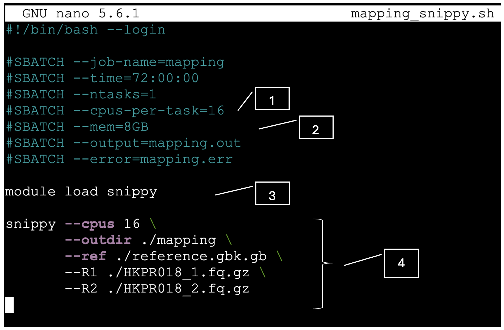

1\. Requesting 16 threads for this mapping job. Mapping the reads usually requires less computational resources for the mapping, we use 16 to speed up

2\. Request for 8 GB RAM for this computation job

3\. Load the software package Snippy

4\. Command for running Snippy:

    --cpus Number of threads used (matched above number we requested)

    --outdir Output directory

    --ref Reference genome in Genbank format

    --R1 FASTQ file of forward reads in each pair

    --R2 FASTQ file of reverse reads in each pair

Close the text editor and submit your first genome assembly job

```bash
sbatch mapping_snippy.sh
```

The running time may take up to 10 minutes.

Once the job has been finished, view the output folder:

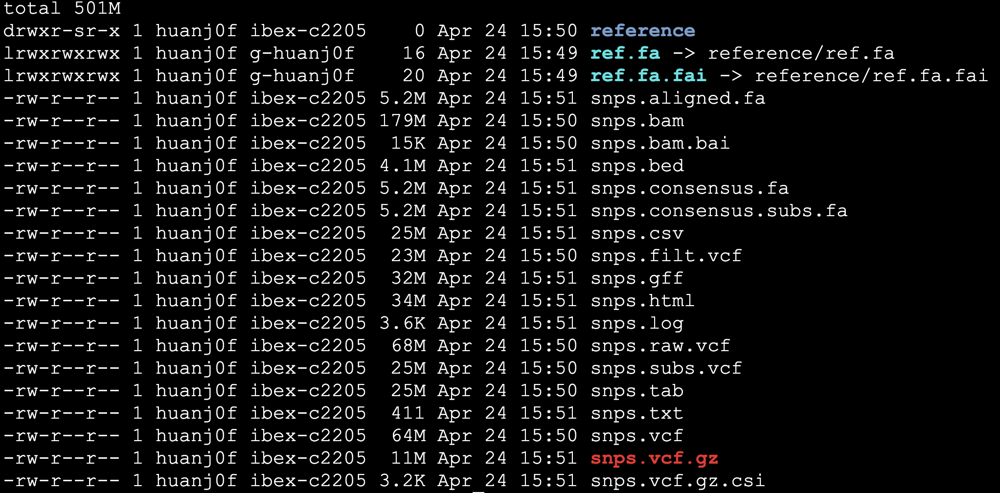

Snippy performs variant calling by aligning sequencing reads to a reference genome, followed by variant detection with in this process. Snippy filters variant calls based on quality thresholds to ensure high-confidence results. By default, it requires a minimum read depth of 10, a minimum base quality of 13, a minimum mapping quality of 60, and an allele frequency of at least 90% to confidently call a variant. Mapping quality reflects how confidently a read is placed in a unique position in the genome—higher values mean less chance the read maps to multiple locations. Allele frequency refers to the proportion of reads at a given position that support a particular variant; requiring 90% ensures that only strong, consistent signals are considered true variants. It outputs annotated variant files, a consensus genome sequence, and alignment files.

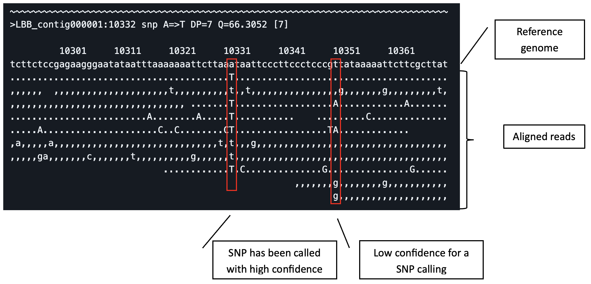

Feel free to explore the output files in various formats. However, for our downstream analysis, we will focus on the snps.consensus.subs.fa file. This file is a modified version of the reference genome in which only the high-confidence SNPs identified in the sample have been substituted, while all other positions remain unchanged. It excludes insertions and deletions to ensure alignment consistency across samples. Snippy generates this file by aligning reads to the reference, calling variants, filtering based on quality metrics, and then incorporating only the substitution SNPs into the consensus sequence. This simplified, SNP-only consensus makes it ideal for building a SNP alignment across multiple isolates, allowing us to compare variation at shared genomic positions and infer relationships between the genomes.

<table>
<colgroup>
<col style="width: 19%" />
<col style="width: 80%" />
</colgroup>
<tbody>
<tr class="odd">
<td><strong>Extension</strong></td>
<td><strong>Description</strong></td>
</tr>
<tr class="even">
<td>.tab</td>
<td>A simple <a href="http://en.wikipedia.org/wiki/Tab-separated_values"><u>tab-separated</u></a> summary of all the variants</td>
</tr>
<tr class="odd">
<td>.csv</td>
<td>A <a href="http://en.wikipedia.org/wiki/Comma-separated_values"><u>comma-separated</u></a> version of the .tab file</td>
</tr>
<tr class="even">
<td>.html</td>
<td>A <a href="http://en.wikipedia.org/wiki/HTML"><u>HTML</u></a> version of the .tab file</td>
</tr>
<tr class="odd">
<td>.vcf</td>
<td>The final annotated variants in <a href="http://en.wikipedia.org/wiki/Variant_Call_Format"><u>VCF</u></a> format</td>
</tr>
<tr class="even">
<td>.bed</td>
<td>The variants in <a href="http://genome.ucsc.edu/FAQ/FAQformat.html#format1"><u>BED</u></a> format</td>
</tr>
<tr class="odd">
<td>.gff</td>
<td>The variants in <a href="http://www.sequenceontology.org/gff3.shtml"><u>GFF3</u></a> format</td>
</tr>
<tr class="even">
<td>.bam</td>
<td><p>The alignments in <a href="http://en.wikipedia.org/wiki/SAMtools"><u>BAM</u></a> format. Includes unmapped, multimapping reads.</p>
<p>Excludes duplicates.</p></td>
</tr>
<tr class="odd">
<td>.bam.bai</td>
<td>Index for the .bam file</td>
</tr>
<tr class="even">
<td>.log</td>
<td>A log file with the commands run and their outputs</td>
</tr>
<tr class="odd">
<td>.aligned.fa</td>
<td><p>A version of the reference but with – at position with depth=0 </p>
<p>and N for 0 &lt; depth &lt; --mincov (<strong>does not have variants</strong>)</p></td>
</tr>
<tr class="even">
<td>.consensus.fa</td>
<td>A version of the reference genome with <em>all</em> variants instantiated</td>
</tr>
<tr class="odd">
<td><mark>.consensus.subs.fa</mark></td>
<td><mark>A version of the reference genome with <em>only substitution</em> variants instantiated</mark></td>
</tr>
<tr class="even">
<td>.raw.vcf</td>
<td>The unfiltered variant calls from Freebayes</td>
</tr>
<tr class="odd">
<td>.filt.vcf</td>
<td>The filtered variant calls from Freebayes</td>
</tr>
<tr class="even">
<td>.vcf.gz</td>
<td>Compressed .vcf file via <a href="http://blastedbio.blogspot.com.au/2011/11/bgzf-blocked-bigger-better-gzip.html"><u>BGZIP</u></a></td>
</tr>
<tr class="odd">
<td>.vcf.gz.csi</td>
<td>Index for the .vcf.gz via bcftools index)</td>
</tr>
</tbody>
</table>

**Multi-Isolate SNP Calling Using Consensus Alignments**

Next, we will take the snps.consensus.subs.fa files generated from multiple isolates and combine them into a single multi-FASTA file. This file represents the SNP-only consensus sequences for each genome, aligned to the same reference. Since all sequences are of equal length and aligned by position, they are ready for comparative analysis.

**Introduction to SNP-sites**

snp-sites is a fast and lightweight tool designed to efficiently extract SNPs from a multi-FASTA alignment. It identifies polymorphic sites across aligned genomes and outputs them in multiple formats (e.g. VCF, FASTA, PHYLIP) suitable for downstream analysis like phylogenetics or genome-wide association studies. Remarkably, it can process large datasets using minimal computational resources—for example, parsing an 8.3 GB alignment with over 1,800 taxa in under five minutes using just a single CPU and 59 MB of RAM. This makes snp-sites an ideal choice for scalable SNP calling in bacterial genomics.

Let’s start! To generate a multiple-FASTA alignment, we need to rename a bit for our output fasta from the mapping

```bash
cp ./mapping/snps.consensus.subs.fa ./HKPR018.consensus.subs.fa
```

Open the FASTA file with your preferred text editor and edit the FASTA tag to the sample name

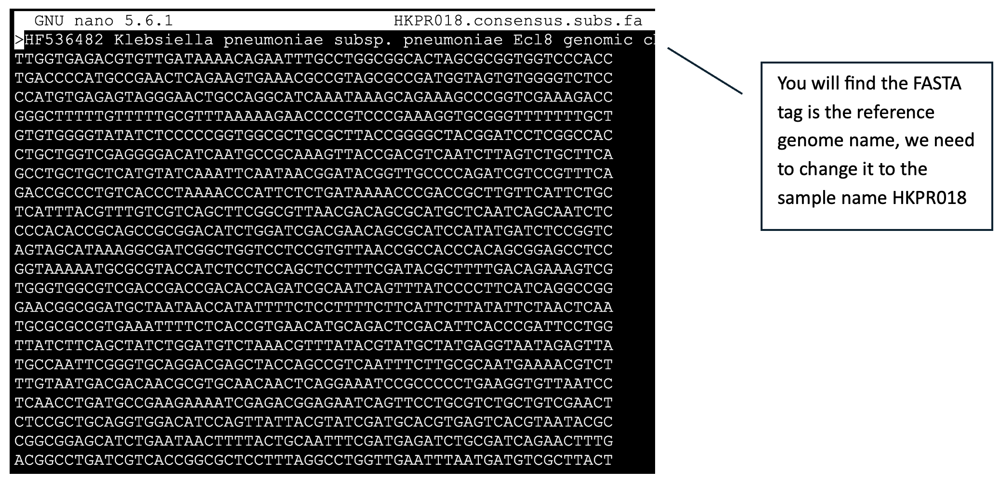

To save time for this practical session, we provide several mapped genomes from our group collection, next we need to concatenate them to make a single alignment file

```bash
cat ./*.consensus.subs.fa > Kp.aln
```

You can visualise the alignment in Aliview (Download the alignment file and open it with Aliview)

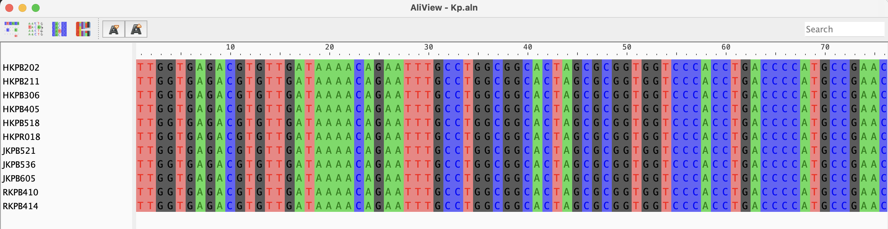

Scroll through the alignment, you can see the SNP base in different samples, see below for example:

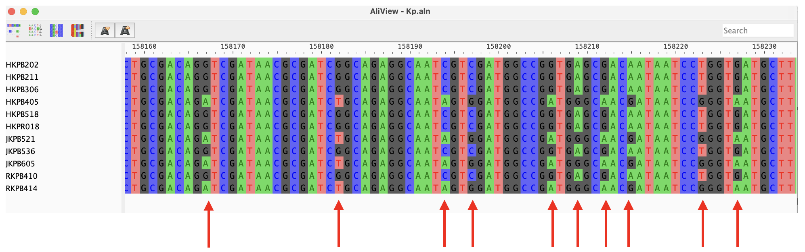

We will use the SNP-site to take these SNPs out from different genomes.

| Kp.aln            | The alignment file for all 11 samples |
|-------------------|---------------------------------------|
| call_snp_sites.sh | Script for running SNP-site           |

View the script through the text editor:

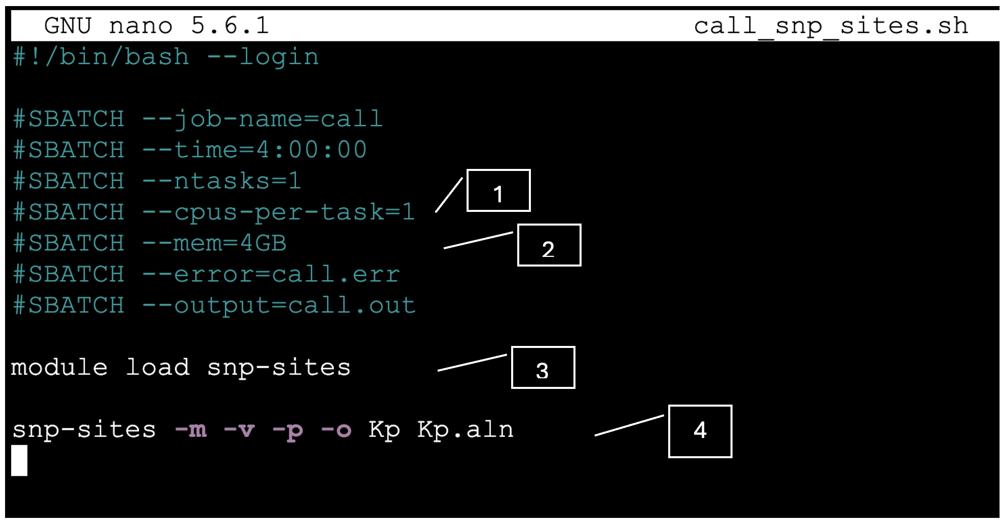

1\. Requesting 1 thread for this job. SNP-sites doesn’t support parallel computing.

2\. Request for 4 GB RAM for this computation job

3\. Load the software package snp-sites

4\. Command for running SNP-sites:

    -m Outputs a multi fasta alignment file (default)

    -v Outputs a VCF file

    -p Outputs a phylip file

    -o Specify an output filename

    Kp.aln Input alignment file

Running SNP-sites is very fast (~20s), check the output file

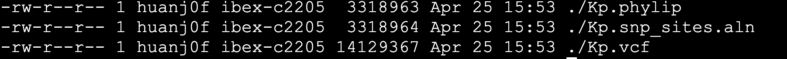

_\*.snp_sites.aln_: Similar to the input file but just containing the SNP sites.

_\*.vcf_: This contains the position of each SNP in the reference sequence, and the occurrence in each other sample. Can be loaded into Artemis for visualisation.

_\*.phylip_: All the SNP sites in a format for RAxML and other tree building applications.

Feel free to explore the Phylip and VCF files by yourself. We will focus on the fasta (.aln) file for future analysis, now view it in aliview and see how it looks compared to the previous alignment.

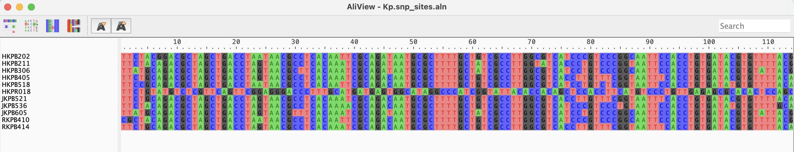

What can we do for the variant called from each sample? We will discuss it in next practical.
