**Phylogeny**

Phylogeny is the study of the evolutionary history and relationships among organisms, genes, or species. It aims to reconstruct how different groups are related through common ancestry and how they have diversified over time. These relationships are typically represented using a phylogenetic tree, a diagram where each branch point, or node, signifies a common ancestor, and the branches themselves reflect the divergence of lineages. The root of a tree represents the most recent common ancestor of all the entities under study, while branch lengths can indicate either the amount of genetic change or the time elapsed. Phylogenetic analysis enables researchers to uncover patterns of descent, identify closely related groups (clades), infer the timing of evolutionary events, and explore how traits such as virulence, antibiotic resistance, or adaptation have evolved. In modern biology, phylogenetic trees are most often built from genetic sequence data, which provide detailed records of evolutionary change at the molecular level. Applications of phylogenetic methods span a wide range of fields, including tracking the spread of infectious diseases in microbiology, investigating species origins in evolutionary biology, studying gene family expansions in genomics, and guiding conservation strategies by identifying evolutionarily distinct populations. As such, phylogenetic analysis is a fundamental tool for understanding the complexity of biological diversity and evolution.

**Aim of This Session**

- Introduce the basic concepts of phylogeny and tree-building methods.

- Construct a Neighbour Joining (NJ) tree using the ape package in R.

- Build a Maximum Likelihood (ML) tree using FastTree.

- Visualise and annotate phylogenetic trees using ggtree in R.

- Understand key differences between NJ and ML methods through hands-on examples.

**Introduction to Neighbour Joining (NJ) Method**

The Neighbour Joining (NJ) method is a widely used distance-based algorithm for constructing phylogenetic trees. It starts with a matrix of pairwise distances between sequences, which are usually calculated based on genetic differences. The goal of NJ is to find the tree topology that minimizes the total branch length, providing a simple and efficient approximation of evolutionary relationships. At each step, the algorithm identifies the pair of nodes (sequences or groups of sequences) that are closest together, “joins” them into a new internal node, and updates the distance matrix to reflect this new relationship. This process is repeated iteratively until all sequences are connected into a single tree.

One of the main advantages of the Neighbour Joining method is its speed and scalability, making it suitable for large datasets. NJ does not assume that all lineages evolve at a constant rate (no molecular clock assumption), allowing it to better model real biological data where evolutionary rates may vary. However, since NJ relies solely on distance information and not on a full model of sequence evolution, it can sometimes be less accurate than model-based approaches like Maximum Likelihood, especially when evolutionary rates vary greatly among lineages.

Neighbour Joining is often used for initial or exploratory analyses, to quickly visualise relationships among sequences before applying more computationally intensive methods. It is easily implemented in R using the ape package, which provides functions to compute distance matrices and build NJ trees.

For the NJ tree construction, we use the R ape package (https://cran.r-project.org/web/packages/ape/index.html). The ape (Analysis of Phylogenetics and Evolution) package is a comprehensive toolkit for working with phylogenetic data in R. It provides functions for reading, writing, plotting, and manipulating phylogenetic trees, as well as tools for analyzing comparative data within a phylogenetic framework. With ape, users can build trees using methods like Neighbour Joining (NJ) and BIONJ, compute genetic distances from DNA sequences, and perform ancestral character reconstruction and diversification analyses. The package also supports sequence handling, including reading nucleotide sequences, translating DNA into amino acid sequences, and assessing sequence alignments. Additionally, ape offers utilities for evolutionary rate estimation, tree dating, and graphical exploration of phylogenetic data. It serves as a foundation for many other R phylogenetics packages and integrates with external programs like PhyML and Clustal for more advanced analyses.

Today’s work can be mainly done on your laptop. Open the R Markdown _Day5_phylogeny.Rmd_ in RStudio, and make sure the _ST231.snp_sites.aln_ is in your R working directory:

Note that file _ST231.snp_sites.aln_ can be named as _KP.snp_sites.aln_.

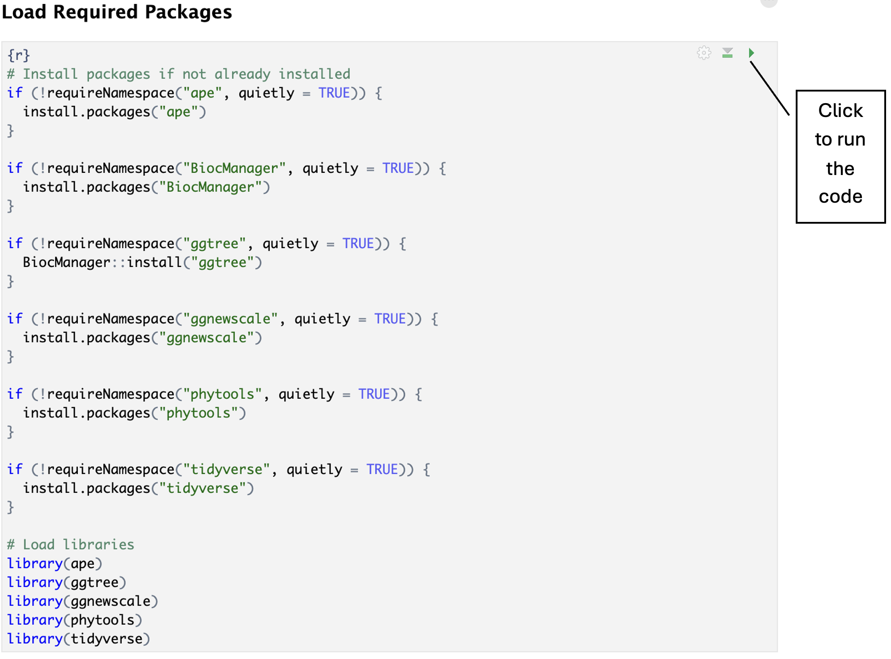

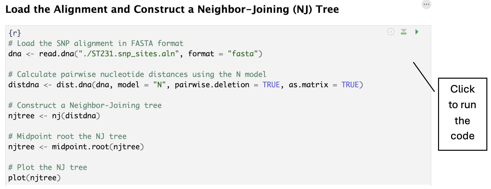

Step by step for the code above:

- We Read the DNA sequence alignment file _ST231.snp_sites.aln_ in FASTA format into R. The sequences are loaded as a DNAbin object, which is a format used by the ape package for handling DNA data.

- Calculates a pairwise genetic distance matrix from the DNA sequences. _model = "N"_ means raw distance (no model correction, simply counts differences). _pairwise.deletion = TRUE_ allows gaps/missing data to be ignored case-by-case during distance calculation. _as.matrix = TRUE_ returns the distances as a regular matrix format for easy handling.

> View the distdna matrix:
>
> 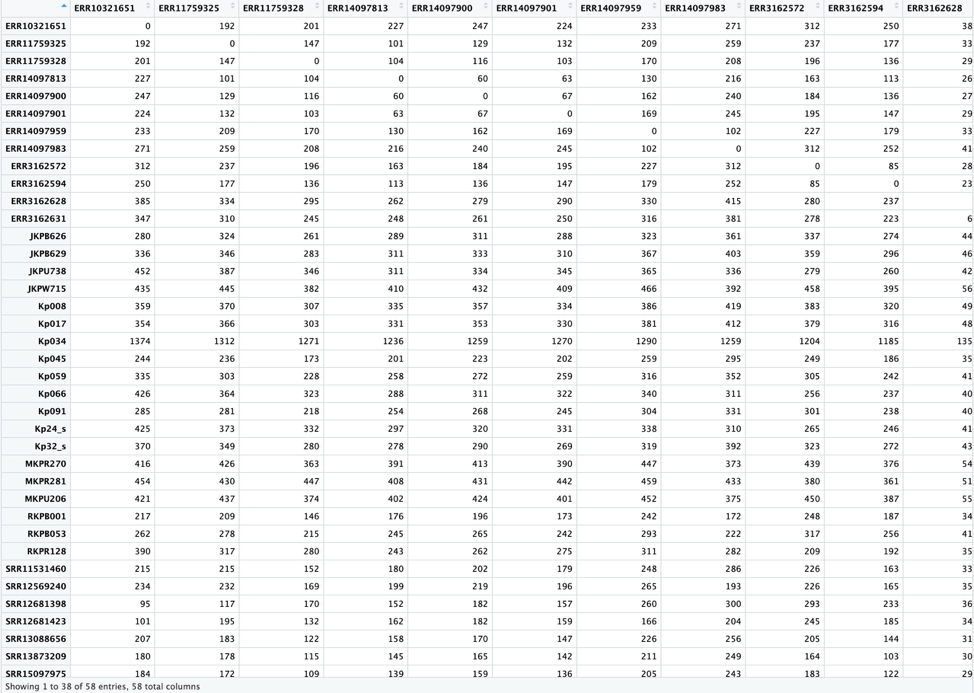

- Constructs a Neighbour Joining (NJ) tree based on the distance matrix. This results in a phylogenetic tree object representing the evolutionary relationships inferred from the distance data.

- Roots the tree at the midpoint between the two most distant taxa. This is useful when there is no known outgroup — it helps visualize the tree more symmetrically.

- Plots the NJ tree, providing a basic view of the tree constructed

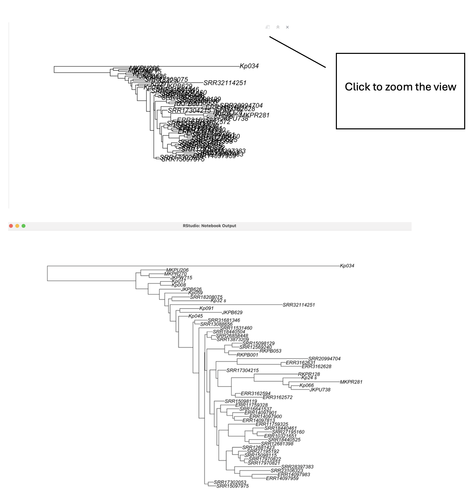

**Introduction to Maximum Likelihood Phylogenetic Inference**

In the previous section, we used the Neighbour Joining (NJ) method to quickly build a phylogenetic tree based on pairwise genetic distances. NJ is fast and effective, especially for exploratory analysis, but it simplifies the evolutionary process by reducing sequence data to distances alone. This can sometimes limit the accuracy of the resulting tree, especially when evolutionary rates vary widely across lineages or when substitution patterns are complex.

To address these limitations, more sophisticated approaches like Maximum Likelihood (ML) are used. Maximum Likelihood methods do not rely solely on pairwise distances. Instead, Maximum Likelihood (ML) evaluates many possible tree topologies and branch lengths to find the one that maximizes the probability (likelihood) of observing the given sequence data under a specified evolutionary model. Although ML approaches are computationally more intensive, they generally produce more accurate and statistically robust phylogenetic trees, particularly for complex datasets.

Today, we will use FastTree, a widely used tool that approximates Maximum Likelihood trees (<https://morgannprice.github.io/fasttree/#Install>).

Log in to the IBEX and set your directory for today’s session.

```bash
cp -r /ibex/project/c2325/B294c/Practical_sessions/Day5_Phylogeny/\* /ibex/user/\<YourUserName\>

ls
```

| Kp.snp_sites.aln | DNA sequence alignment in FASTA format |
|------------------|----------------------------------------|
| Run_fasttree.sh  | Script for running FastTree            |

Open the script for running FastTree: _run_fasttree.sh_

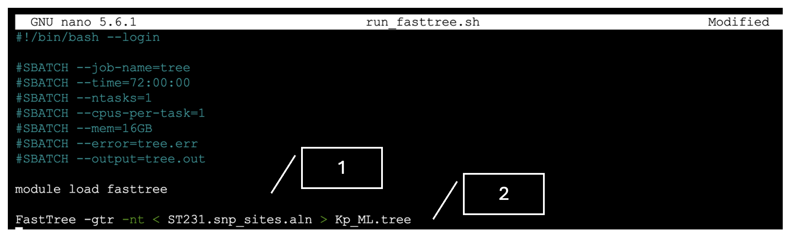

1\. Load the FastTree package

2\. Command for running FastTree

    -nt Tells FastTree that the input is a nucleotide alignment

    -gtr Uses the General Time Reversible (GTR) model of nucleotide substitution

**What is the GTR model?**

The General Time Reversible (GTR) model is one of the most widely used nucleotide substitution models in molecular evolution. It describes how DNA sequences evolve over time by accounting for the rates at which one nucleotide replaces another. The model assumes that the substitution process is reversible; that is, the rate of substitution from nucleotide A to G is the same as from G to A, when adjusted for nucleotide frequencies.

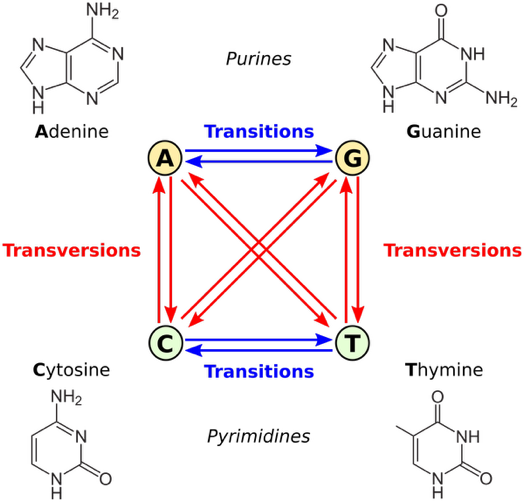

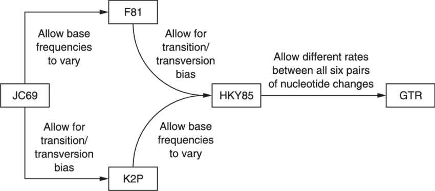

_\< Kp.snp_sites.aln_ Redirects the content of the file Kp.snp_sites.aln into FastTree as standard input

_\> Kp_ML.tree_ this redirects the output tree (in Newick format) to a file named Kp_ML.tree.

Submit your job to IBEX, and running this code will take approximately 4–5 minutes. In comparison, constructing the NJ tree is significantly faster—once you click the button in R, it completes in about 1 second.

Download your tree file, and we will visualise it in R:

```bash
scp \<YourUserName\>@ilogin.ibex.kaust.edu.sa:/ibex/user/\<YourUserName\>/path/for/your /assembly /path/to/your/R/working_space
```

and look back at the R code:

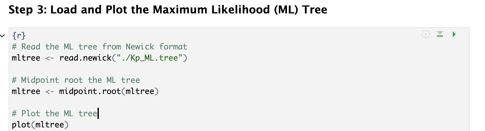

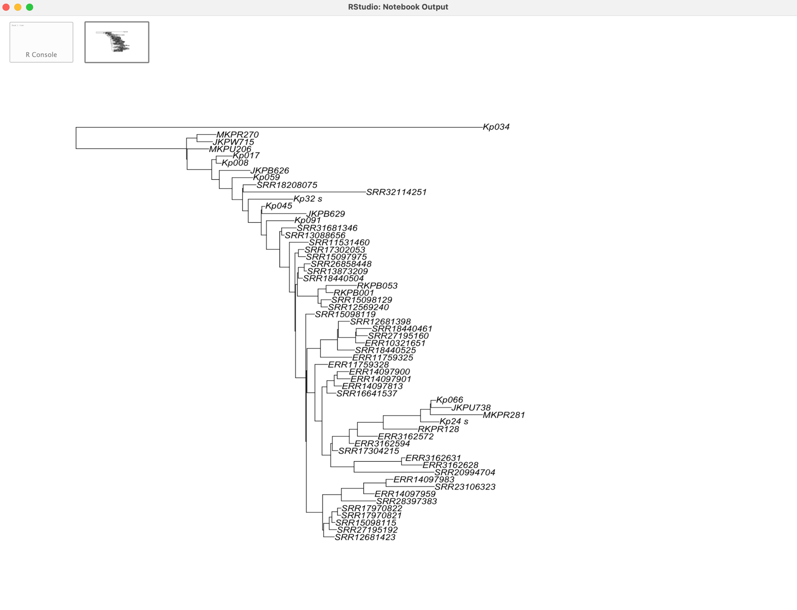

You may observe some differences between the Neighbor-Joining (NJ) tree and the Maximum Likelihood (ML) tree. However, at this point, the visual comparison may not be very informative because the trees lack proper scaling, annotations, and context.

**Add more information to your tree with ggtree**


Ggtree is an R/Bioconductor package (https://github.com/YuLab-SMU/ggtree) designed for visualising tree-like structures along with their associated data. Over five years of active development, it has grown into a suite of packages: treeio (for tree file input/output), tidytree (for manipulating tree data), and ggtree (for visualisation). While ggtree was initially built for phylogenetic trees, its functionality has expanded to support a broader range of hierarchical data structures, enabling its use across various scientific fields.

For these samples, we have prepared a metadata table that provides important contextual information. This includes the year of collection, sequence type (ST), and the presence or absence of key antimicrobial resistance genes. Specifically, it highlights whether the ESBL gene *CTX-M-15* is present, as well as carbapenemase genes *OXA-232* and *NDM-1*. This metadata supports deeper interpretation of the phylogenetic and genomic analyses.

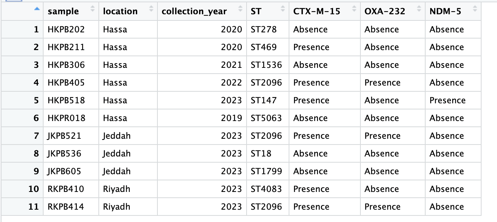

Let’s continue the R Markdown code in R Studio:

Note that file _metadata_for_plot.tsv_ can be named as _metadata.csv_.

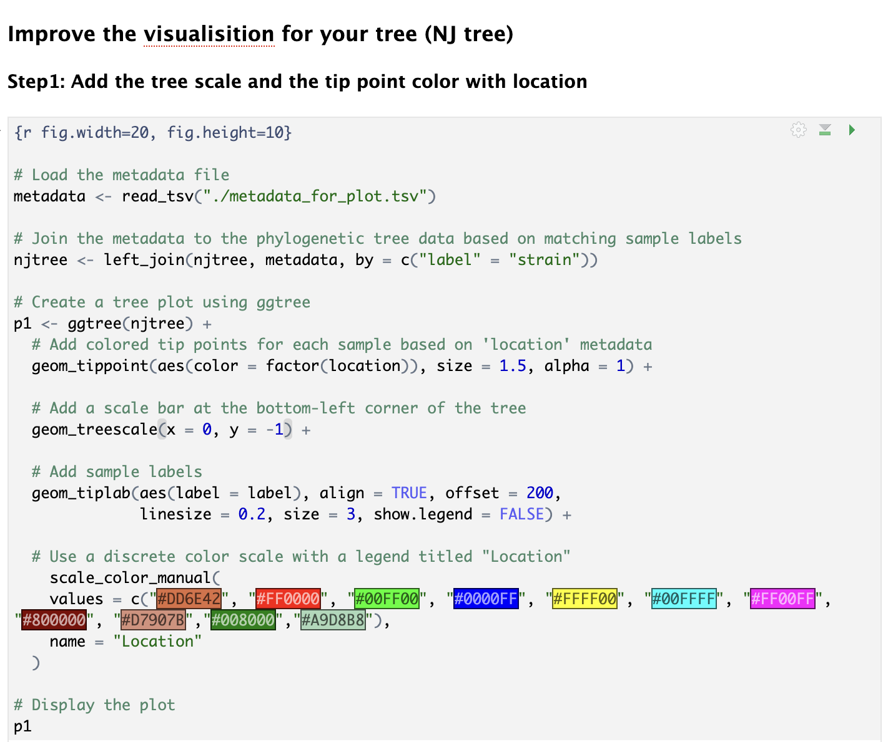

This part of the code adds visual annotation to a phylogenetic tree by incorporating metadata about the sample’s geographic location. After reading the metadata using _read_csv()_, the _left_join()_ function is used to merge this metadata with the tree object (njtree).

In the _ggtree()_ plotting pipeline, the function _geom_tippoint()_ is used to add colored points to the tips of the tree. The _aes(color = factor(location))_ aesthetic tells R to color each tip point according to the sample’s location, treating the location variable as a categorical factor. The _size = 1.5_ sets the size of the points for better visibility, and alpha = 1 makes them fully opaque.

Run the code and view the plot:

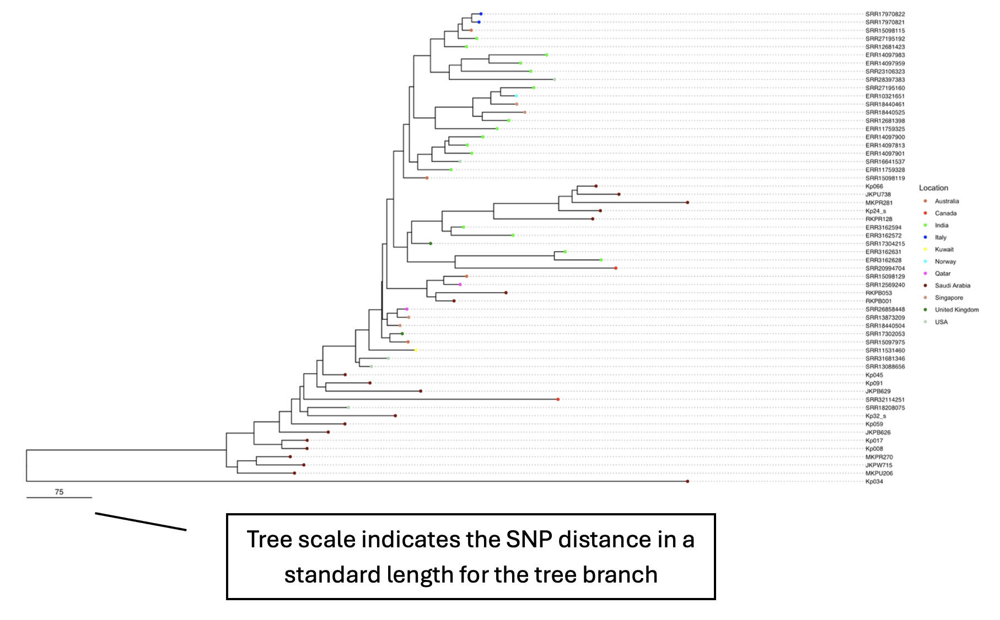

Then, let’s add a heatmap annotation to the phylogenetic tree, representing the sample collection years from 2015 to 2024. View the code in the next section:

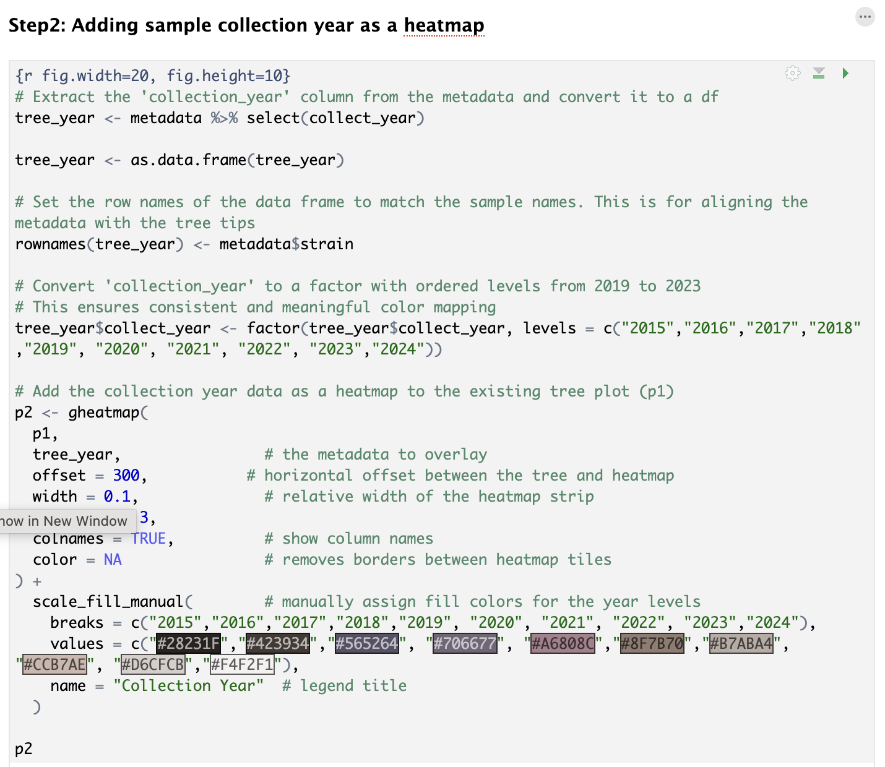

First, the collection_year column is extracted from the metadata and converted into a data frame with sample names as row names. The collection years are then explicitly ordered as factor levels to control their appearance in the heatmap. Using the _gheatmap()_ function, the year information is aligned alongside the tree tips with a defined offset and width for readability. The _scale_fill_manual()_ function assigns a custom colour palette to each year, making it easier to visually distinguish temporal patterns in the dataset. This visualisation helps to identify any temporal clustering or evolutionary trends across different years of sample collection.

Run the code and view the updated plot:

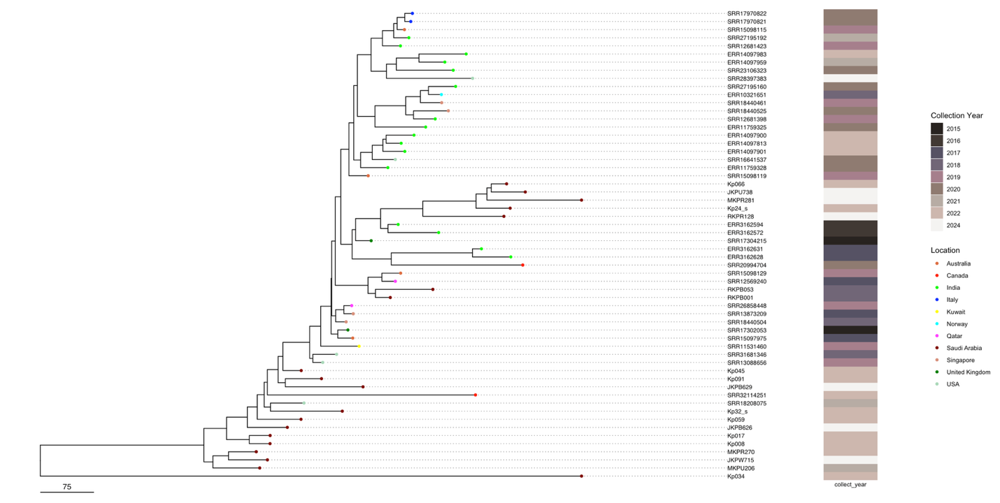

Further, we can add a second heatmap to the phylogenetic tree to visualise the presence and absence of key resistance genes of ESBL and Carb (*bla*<sub>CTX-M-15</sub>*, bla*<sub>OXA-232</sub>) of each sample alongside the previously added collection year annotation. In this part of the code, we selected three AMR gene columns—CTX-M-15, OXA_232 from the metadata all at once using _select()_. Run the code and view the plot:

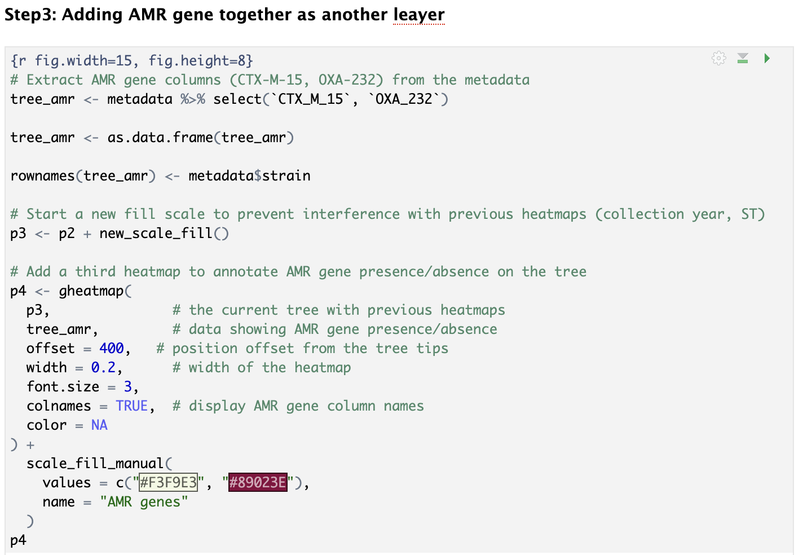

The line _p3 \<- p2 + new_scale_fill()_ is necessary because both heatmaps (for collection year and genes) use color fill aesthetics. In ggplot2, you can’t apply two different _scale_fill_manual()_ calls for different data layers unless you explicitly reset the fill scale using _new_scale_fill()_ from the ggnewscale package.. The gheatmap() function is then used to append the ST data as a second heatmap next to the tree, with adjustable offset and width. The final plot (p4) shows the phylogenetic tree annotated with both collection year and ST information.

View the plot:

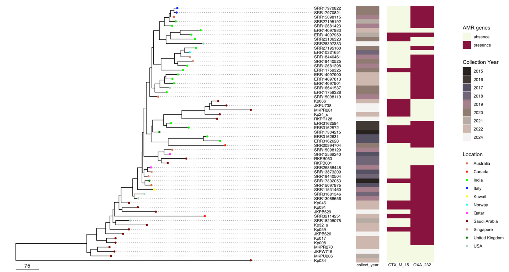

In summary, we’ve progressively enhanced our phylogenetic tree visualisation by layering important metadata as heatmaps alongside the tree. Starting with the collection year, then adding sequence type (ST), and finally AMR gene presence, each step adds valuable biological context to the tree structure. This layered annotation approach allows us to explore relationships between phylogeny and key epidemiological or genetic features, making the visualisation a powerful tool for understanding patterns in our dataset.
