In this guide, we’ll employ a Bayesian discrete phylogeographic framework to reconstruct the ancestral geographic origins of bacterial lineages while simultaneously mapping their host-shift events.

**Introduction:**

1.  Preparing the Input  
    Begin by converting your multiple-sequence alignment (in FASTA format) into an XML file that BEAST can read. This conversion is handled by BEAUti (Bayesian Evolutionary Analysis Utility), which provides a graphical interface for specifying the evolutionary model parameters and configuring MCMC settings.

2.  Running the Analysis  
    With the XML file ready—containing your sequence data, model definitions, and MCMC options—launch BEAST to perform the phylogeographic reconstruction.

3.  Reviewing Results  
    After BEAST completes, examine the output files to check for convergence issues, troubleshoot any problems, and extract summary statistics that describe the inferred ancestral locations.

**Prerequisites:**

Please download and install the following tools—choosing the appropriate package for your operating system (macOS, Windows or Linux/UNIX):

- BEAST  
  A suite that includes the BEAST inference engine, BEAUti graphical setup tool, and TreeAnnotator for tree annotation tool. We recommend using BEAST v1.10.4 Installers and release notes are available on GitHub: [<u>https://github.com/beast-dev/beast-mcmc/releases</u>](https://github.com/beast-dev/beast-mcmc/releases)

<!-- -->

- BEAGLE  
  A high-performance computational library that accelerates likelihood and Bayesian calculations—optionally leveraging multicore CPUs and GPUs. Binaries and build instructions can be found at [<u>https://github.com/beagle-dev/beagle-lib</u>](https://github.com/beagle-dev/beagle-lib)

- Tracer  
  A graphical application for inspecting BEAST (and other MCMC) output. It provides summary statistics and convergence diagnostics for continuous parameters. Current stable release is v1.7.2, downloadable from [<u>https://github.com/beast-dev/tracer/</u>](https://github.com/beast-dev/tracer/)

- FigTree  
  An interactive viewer for phylogenetic trees—ideal for displaying, annotating, and exporting trees generated by BEAST. Version 1.4.4 is the latest, available at [<u>https://github.com/rambaut/figtree/</u>](https://github.com/rambaut/figtree/)

- SPREAD4  
  A web-based platform for mapping and animating phylogeographic reconstructions produced by BEAST. Try it online at [<u>https://spreadviz.org/home</u>](https://spreadviz.org/home)

**Exerice:**

All the exercise data lives in the GitHub repo. To fetch it:

1.  Open your terminal.

2.  Clone the repository:

```bash
git clone <https://github.com/gzhoubioinf/BEAST_Tutorial.git>
```
Change into the tutorial directory:
```bash
cd BEAST_Tutorial
```
Now you’re ready to proceed with the exercises using the files you just downloaded.

**Running BEAUti:**

***Loading the sequence data file:***

*ST5_beast.fasta*  is a multiple‐sequence alignment of Methicillin-resistant Staphylococcus aureus (MRSA) ST5 isolates that has been processed with Gubbins to detect and remove hypervariable (recombinant) regions, yielding a filtered alignment suitable for downstream phylogenetic analysis.

The tutorial uses *ST5_beast.fasta* as its input. This FASTA alignment comprises 131 Methicillin-resistant Staphylococcus aureus (MRSA) gene sequences, totaling 7,740 nucleotides.

To import the alignment, go to *File → Import Data*... and select *ST5_beast.fasta*. Once the file is loaded, you’ll see the sequence data listed under Partitions, as illustrated below:

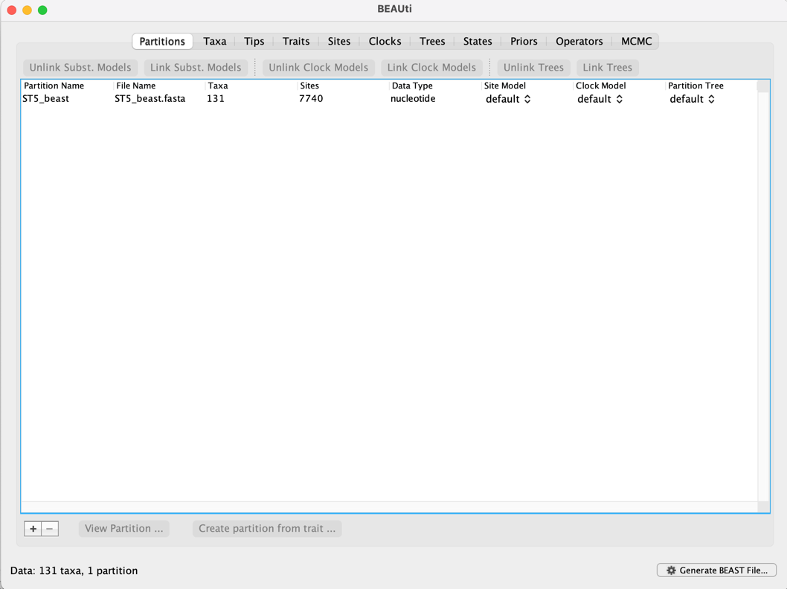

***Specifying the sampling date information:***

By default, every taxon is assigned a date of zero (i.e., all sequences are treated as contemporaneous). Since the MRSA isolates were collected between 2020 and 2024, switch to the *Tips* panel via the tabs at the top.Check Use *tip date*s to enable date assignment.The sampling year for each MRSA sequence is embedded in its label—click *Parse Dates* at the top of the Tips panel.

This action will open a dialog box for parsing and confirming the tip dates:

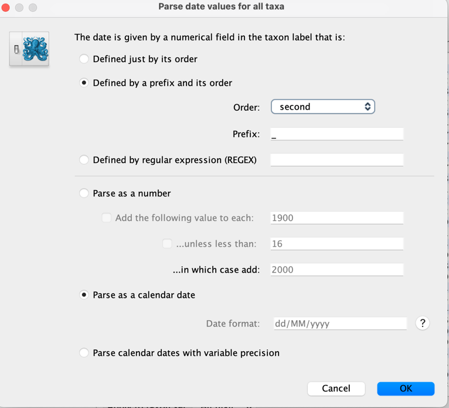

This feature automatically infers sampling dates by scanning each taxon name for numeric segments. If a label contains multiple numeric fields, you can choose which one corresponds to the collection date. For a complete overview of all date‐setting options, refer to the panel’s documentation. With the MRSA dataset, simply leave the default “*Defined by a prefix and its order*” setting, set “*second*” and click *OK*. The parsed dates will then populate the appropriate column in the main window.

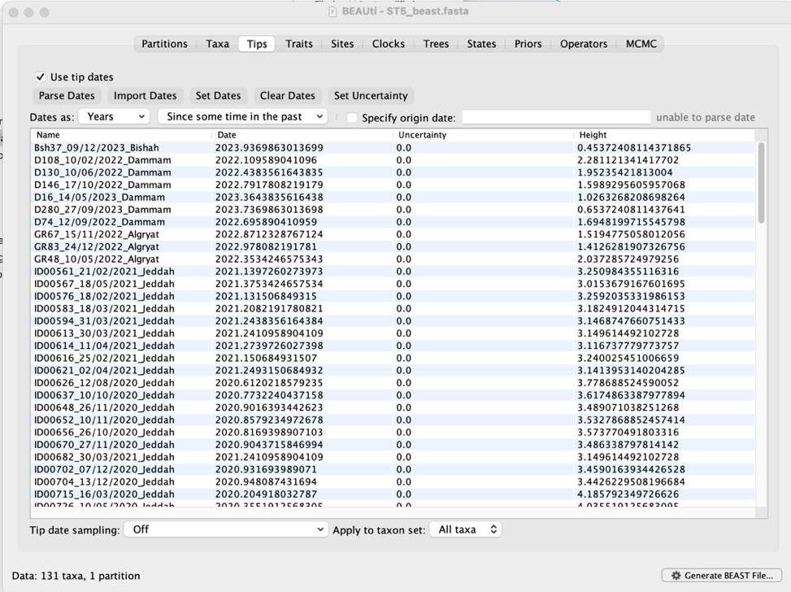

***Specifying the trait information:***

Begin by selecting the *Traits* tab at the top of the main window. In BEAST, a “trait” is any inherent property of a taxon—such as its geographic origin or host species. This step links each sequence to its designated host and location metadata. To do this, click *Add Trait* in the Traits panel, which opens the *Create or Import Trait(s)* dialog. In that window, define a new trait called “cities,” then click *Guess trait values in the main window*. BEAST will then parse and assign each city directly from the taxon labels.

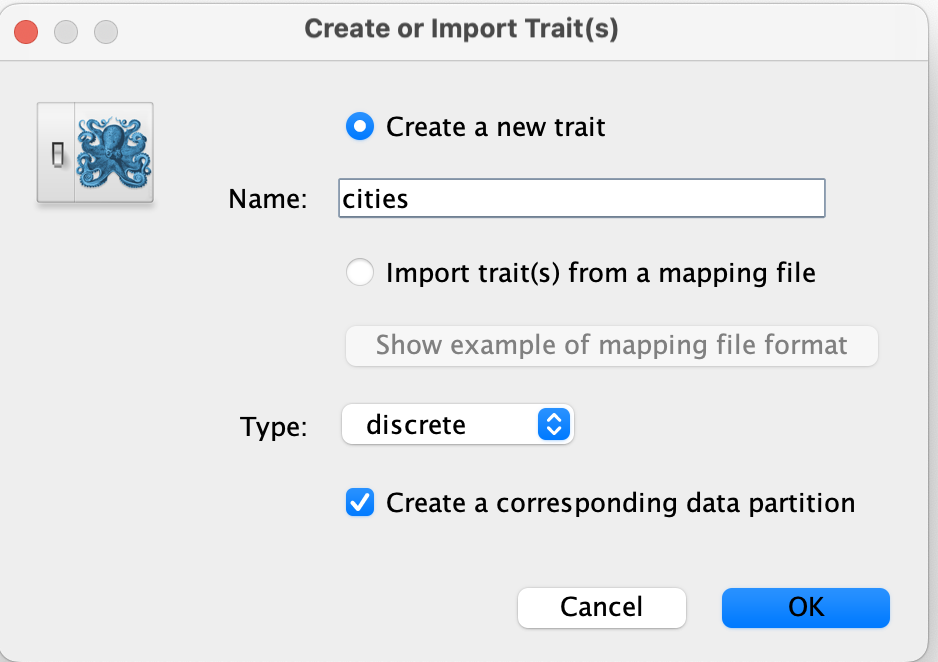

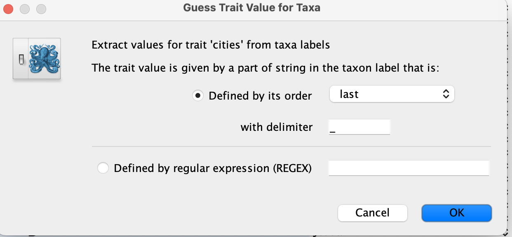

You can click _Guess trait values_ to get the above window

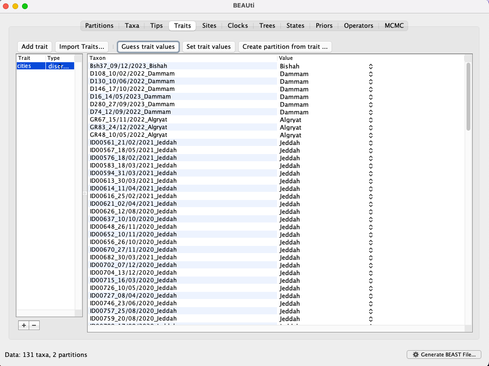

***Setting the sequence and trait evolutionary models:***

Click the *Sites* tab at the top of the main window to access the evolutionary model settings. Under *Substitution Model*, leave *HKY* as the selected option.Set *Base Frequencies* to *Estimated*.*For Site Heterogeneity Model*, choose *None*.

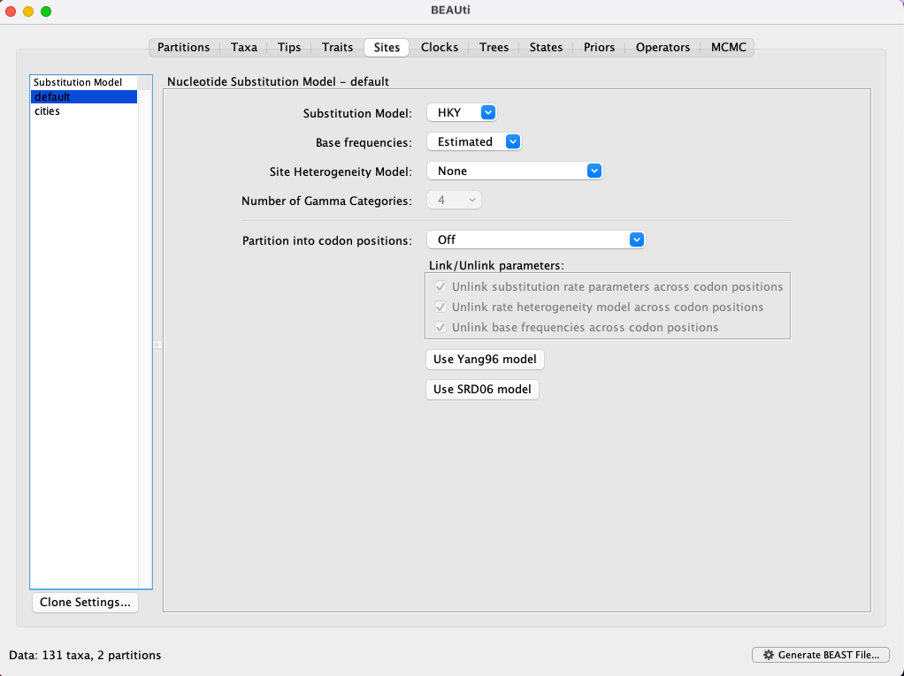

***Setting the ‘molecular clock’ model:***

In the Clocks panel at the top of BEAUti’s main window, open the *Clock Type* dropdown and choose *Strict clock*, which enforces a constant substitution rate across all branches.

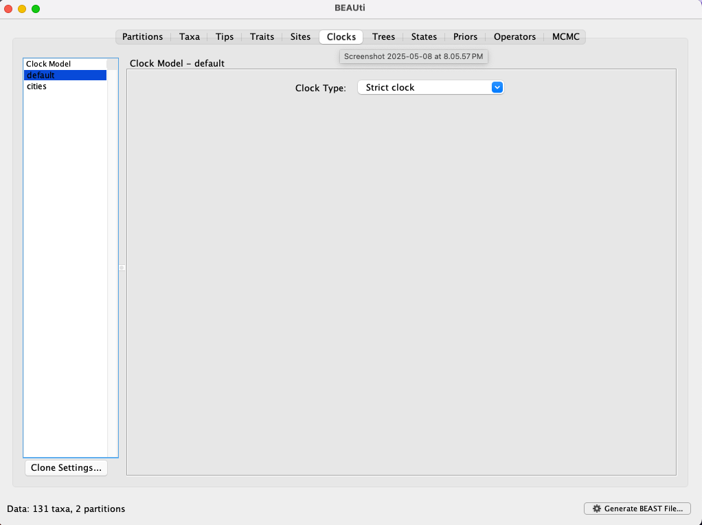

***Setting the tree prior:***

In the Tree panel, the starting tree is set to a *Random starting tree*, and the *Tree prior*—which models how population size changes over time under a coalescent framework—is configured to the default *Constant Size Coalescent* prior. In this tutorial, we will retain these default settings.

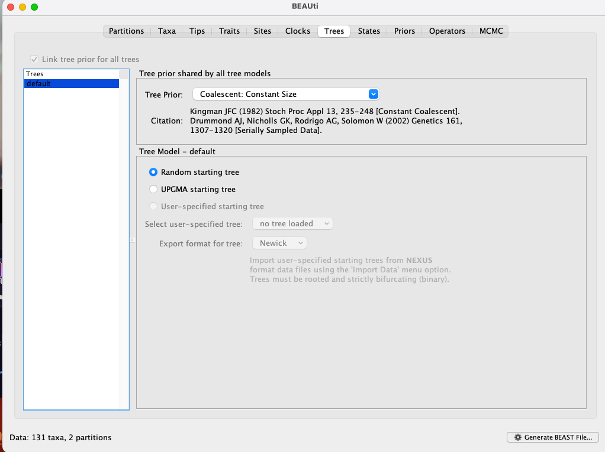

***Setting up the priors:***

In the *Priors* tab you’ll notice that BEAUti has already assigned default, relatively uninformative priors to every parameter. For example, the HKY transition/transversion ratio (*kappa*) is given a LogNormal\[1,25\] prior (initial = 2) and the nucleotide base frequencies (*frequencies*) a Dirichlet\[1,1\] prior. Both the overall substitution rate (*default.clock.rate*) and the discrete‐trait clock rate for our “cities” trait (*cities.clock.rate*) use the Approximate Reference Prior of Ferreira & Suchard (2008). The tree’s root height (*treeModel.rootHeight*) is determined implicitly by the chosen coalescent model rather than an explicit prior, while the coalescent population size parameter (*constant.popSize*) follows a 1/x prior (initial = 1). Finally, for the discrete trait itself, the state frequencies (*cities.frequencies*) use a Uniform\[0,1\] prior (initial = 0.25) and the instantaneous‐transition rates (*cities.rates*) a Gamma\[1,1\] prior (initial = 1). All of these parameters are bounded to nonnegative values, and in this tutorial, we will leave them at their defaults.

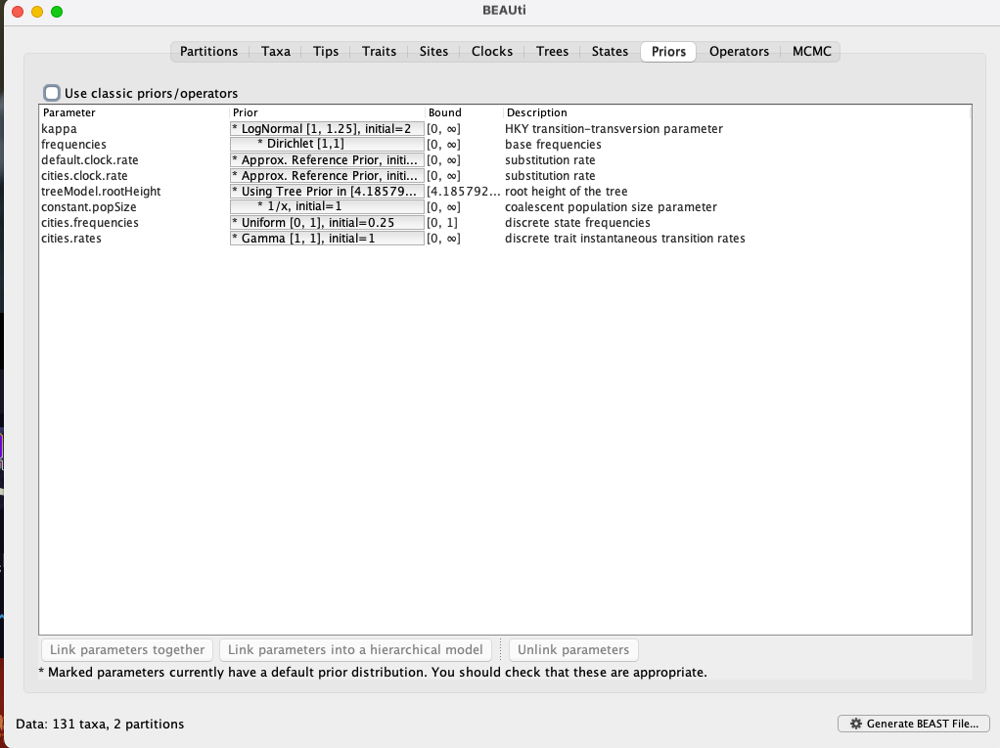

***Setting the MCMC options:***

In the *MCMC* tab you can configure your chain length and logging settings. For this initial test, set the *Chain length* to *100,000* generations, and change both the *Log parameters* every and *Sample trees* every frequencies to *1,000*. This will record parameter values and trees at regular 1,000‐generation intervals throughout the 100,000‐generation run.

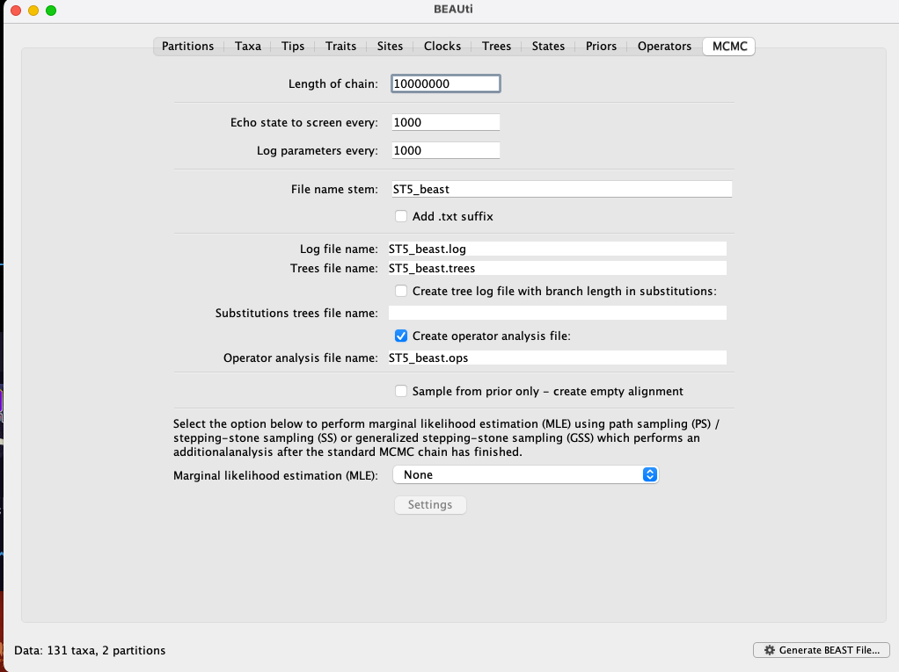

To produce the BEAST XML file, choose *Generate XML*… from the *File* menu (or click the button at the bottom of the BEAUti window). BEAUti will prompt you to review all prior settings one last time and will flag any that appear improper. After confirming, you’ll be asked to select a filename—by default it will use the name you specified in the MCMC panel—and it’s customary to end the name with “.xml” (on Windows you may prefer “*.xml.txt*”). Once you save, your fully configured XML will be ready for BEAST.

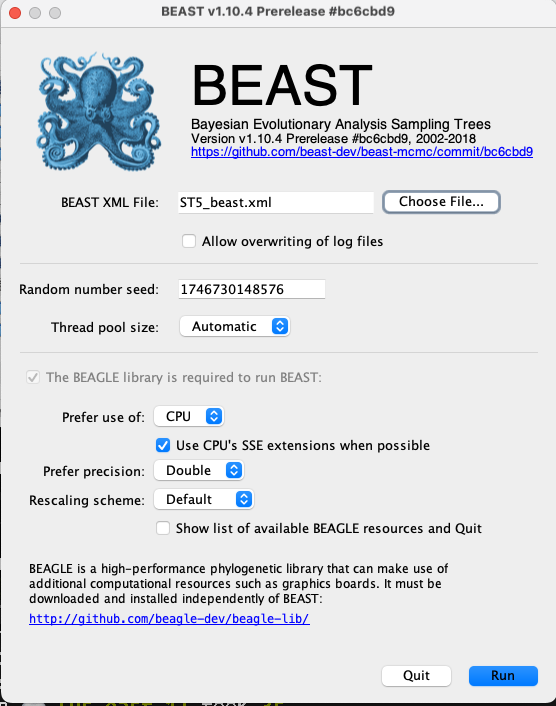

If you’ve installed BEAST as a JAR (rather than a standalone beast binary), you can likewise:
```bash
java -Xmx4g -jar /Users/iftis0a/Downloads/BEAST.v1.10.4.dmg/lib/beast.jar -threads 4 /Users/iftis0a/IDE/July25_course/Day7_BEAST/BEAST_Tutorial/ST5_beast_new.xml
```
***Analyzing the BEAST output using Tracer:***

To analyze the results of running BEAST we are going to use the program Tracer. The exact instructions for running Tracer differs depending on which computer you are using. Double click on the Tracer icon; once running, Tracer will look similar irrespective of which computer system it is running on.

Select the *Import Trace File...* option from the *File* menu. If you have it available, select the log file that you created in the previous section (ST5_beast.log). Alternatively, drag and drop your log file into the Tracer window. The file will load and you will be presented with a window similar to the one below.

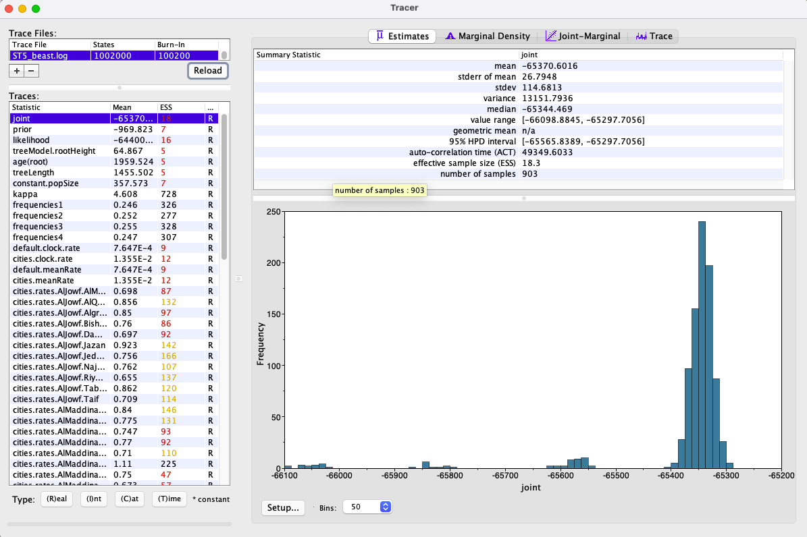

On the left hand side at the top is the name of the log file loaded (in this case ST5_beast.log), the number of states in the log and the burn-in (10% by default). Below this is a table containing all the columns in the log file, including various statistics and continuous parameters. Selecting a trace on the left brings up analyses for this trace on the right hand side depending on the tab that is selected at the top.

Note: Tracer highlights ESS \< 100 in red (and 100–200 in yellow). Low ESS indicates strong autocorrelation and suggests the chain may not adequately explore the posterior. As a result, the histogram in the bottom-right (showing sample frequencies) will appear very jagged.

When you first open the trace, the posterior values (on the log scale—i.e. the product of the data likelihood and the prior probabilities) are selected by default, and summary statistics for this trace are displayed under the Estimates tab. For the age(root) parameter, the Estimates tab appears as follows:

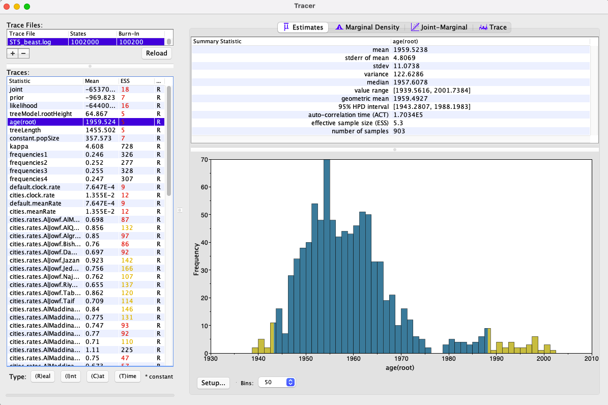

| Statistic                       | Description                                                                                                                                     |
|---------------------------------|-------------------------------------------------------------------------------------------------------------------------------------------------|
| Mean                            | The arithmetic average of all sampled values.                                                                                                   |
| Standard Error of the Mean (SE) | An estimate of how precisely the mean is known, calculated by dividing the sample standard deviation by √(ESS). A small ESS yields a larger SE. |
| Standard Deviation (SD)         | The root of the variance, measuring the typical spread of the samples around the mean.                                                          |
| Variance                        | The average squared deviation of each sample from the mean, quantifying overall dispersion.                                                     |
| Median                          | The midpoint of the sample distribution, such that half the values lie above and half below.                                                    |
| Value Range                     | The difference between the smallest and largest sampled values.                                                                                 |
| Geometric Mean                  | The nth‐root of the product of n samples; useful as a measure of central tendency when the data span several orders of magnitude.               |
| 95% HPD Interval                | The narrowest interval containing 95% of the posterior samples; reported as lower and upper bounds.                                             |
| Auto-Correlation Time (ACT)     | The average number of MCMC steps required for two samples to become effectively independent.                                                    |
| Effective Sample Size (ESS)     | An estimate of how many independent samples your chain is equivalent to, calculated as (total samples – burn-in) ÷ ACT.                         |
| Number of Samples               | The total count of samples used in these calculations (after discarding burn-in).                                                               |

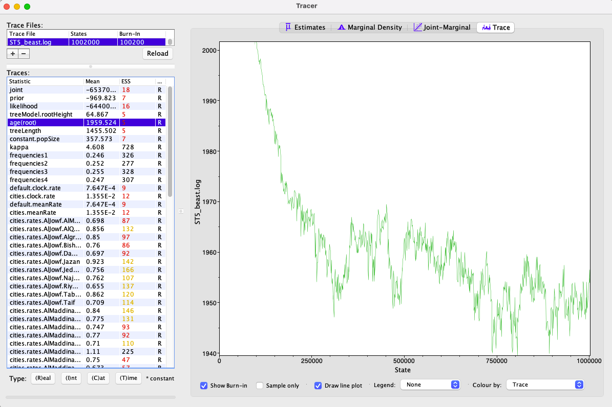

Here we see strong autocorrelation in the trace: although we collected 1 002 samples (running the MCMC for 1 002 000 steps, sampling every 1 000), adjacent points often cluster together. As a result, the ESS for the root-age parameter (age(root)) is only about 5—meaning we obtain just one effectively independent sample for every ~200 recorded points.

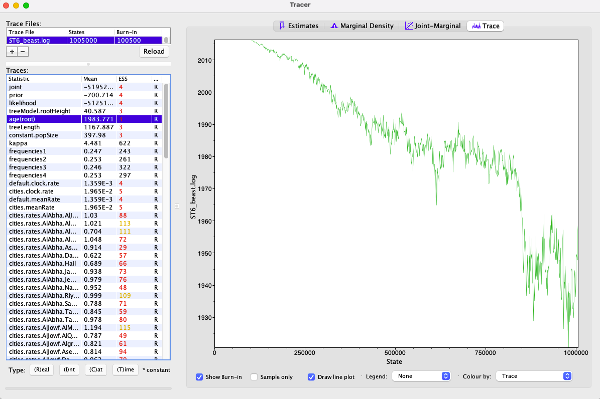

You can load the long run log file (ST5_beast.log) into the same Tracer window for comparison to the short run. This gives this:

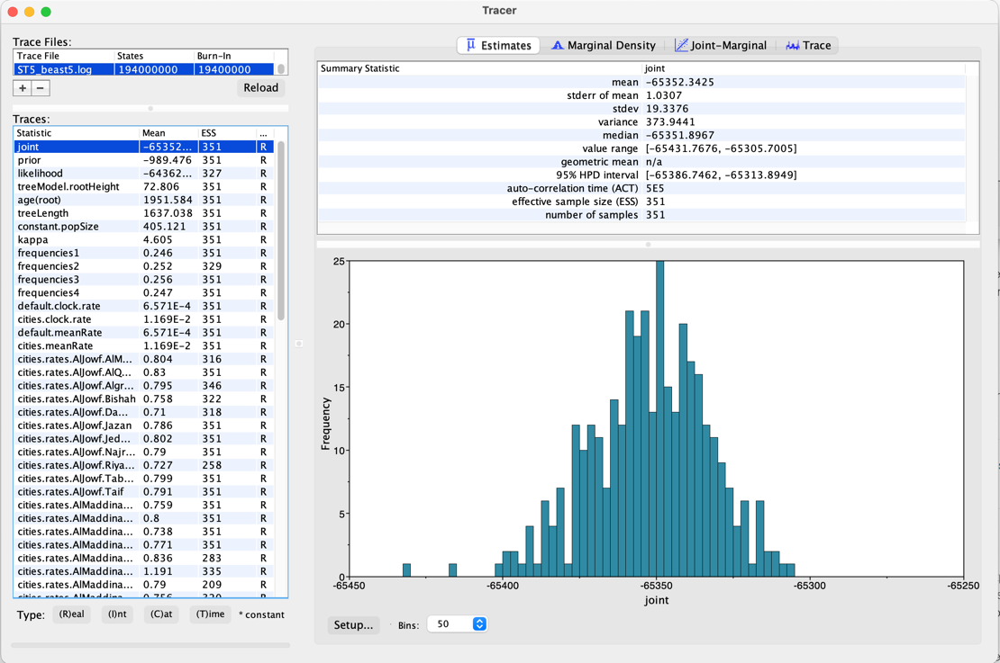

**Summarizing and annotating trees:**

***Annotating a “target” tree with TreeAnnotator:***

TreeAnnotator enriches a user-provided “target” tree by summarizing statistics across all sampled trees. For each clade in your target tree it records:

- Mean node age and its 95 % HPD interval

- Posterior probability (clade support)

- Average branch-specific substitution rate (if your model allows rate variation)

***Step-by-step procedure:***

1.  Launch TreeAnnotator

2.  Input Tree File: *select ST5_beast5.trees*

3.  Burn-in: set to 10 (number of states to discard)

4.  Output File: specify *ST5_final_trees.tre*

5.  Run: click Run

TreeAnnotator will read your sampled trees, compute the summaries for every clade in the target, and write the annotated tree in standard NEXUS format. You can view the basic topology and support values in any NEXUS‐capable viewer, and see the full node-age and rate annotations in *FigTree*.

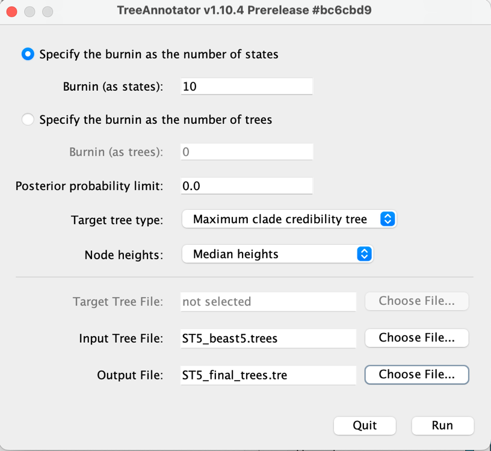

***Viewing the annotated tree:***

Open FigTree and go to File → Open…, then load the annotated tree file you generated with TreeAnnotator. Once the tree appears, use the controls on the left to adjust its display:

- Reorder nodes for a ladderized layout:

    - From the *Tree* menu, choose *Increasing Node Order*.

    - This arranges internal nodes so that recent splits appear “inside” older ones, producing a clean, ladder-like tree.

- Display 95 % HPD node‐age bars:

    - In the left-hand control panel, expand *Node Bars*.

    - Under Display: select *height_95%\_HPD*.

    - Horizontal bars at each node now span the 95 % Highest Posterior Density interval for that divergence time.

- Show node‐age labels:

    - In the control panel, expand *Node Labels*.

    - Check *Show Node Labels*, and under *Display*: choose *node age* (or *height*).

    - Each node will now be annotated with its estimated age (median or mean).

- Customize branch appearance:

    - Expand *Appearance* in the left panel.

    - Increase *Line Weight* (e.g. from 1.0 to 2.0) for thicker branches.

    - To color a clade:

        - In the toolbar, select the *Clade selection* tool (a branching icon).

        - Click on the branch leading to your clade of interest.

        - In the *Appearance* panel, click the color swatch and pick a new color

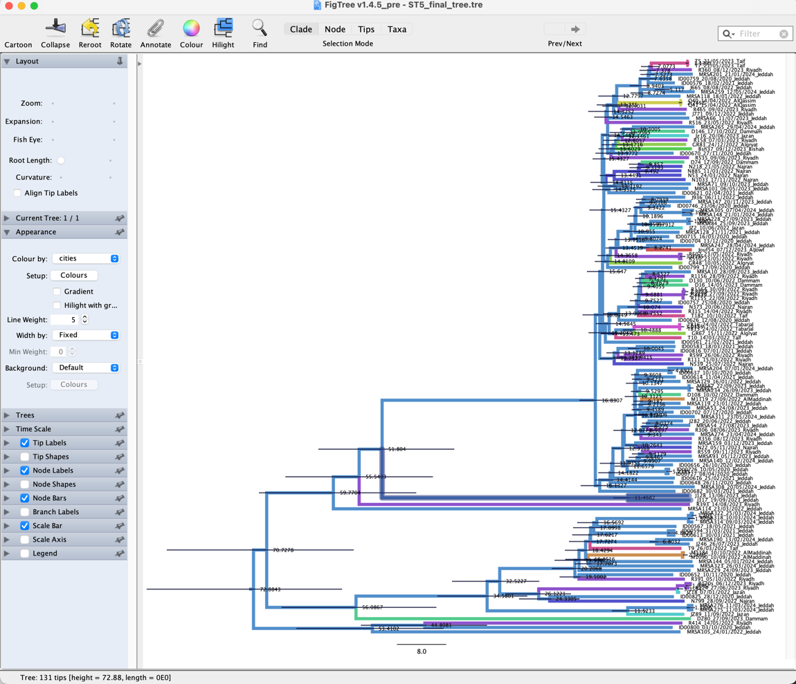

**Visualizing MCC trees and calculating Bayes factor support for rates using SPREAD 4:**

SPREAD4 (Spatial Phylogenetic Reconstruction of EvolutionAry Dynamics, version 4) is a web-based application for visualizing the results of Bayesian phylogeographic analyses. It takes the posterior tree and trait reconstructions generated by BEAST (or similar software) and plots inferred dispersal routes, ancestral locations, and trait transitions directly onto customizable maps. Because it runs entirely in your browser (Firefox, Safari, Chrome), there’s no installation required—simply upload your .log and .trees files, select your base map (or upload your own), and explore animated reconstructions of evolutionary spread through time and space.

***Visualization of location-annotated maximum-clade-credibility (MCC) trees:***

After you’ve used *TreeAnnotator* to produce an MCC tree (e.g. *ST5_final_tree.tre*), each internal node in that tree carries a most-probable ancestral location state. By pairing that .tre file with a simple coordinates table (mapping each location name to its latitude and longitude), you can load both into a visualization tool (such as SPREAD4 or SpreaD3). The program then draws your phylogeny overlaid on a geographic map, coloring branches by inferred state changes and positioning node‐age bars or labels at their real‐world coordinates. This lets you see, for example, when and where lineages crossed between cities or regions.

To visualize an MCC tree, click on *Run new analysis* and select the *Discrete MCC tree tab*. Load the MCC tree and coordinates in the *‘ST5_coordinates.tsv’* file, which should look like this:

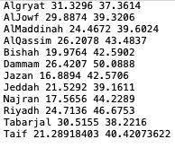

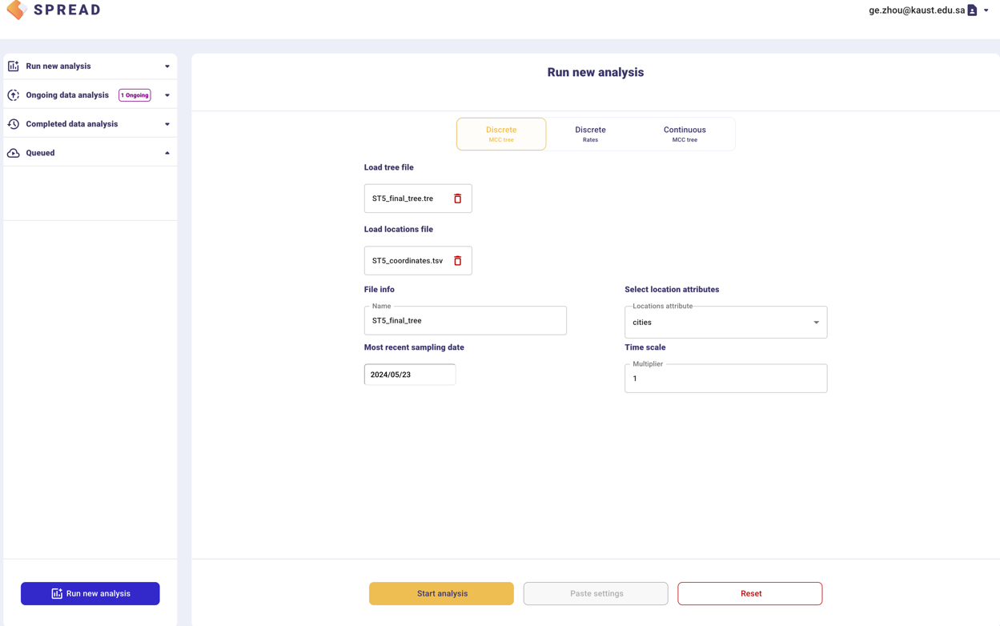

The analysis will first appear in the left-side tab *Queued* and then in the *Completed Data Analysis*.


An example visualisation can be found below. Note that the visual aspects of the lines representing the rates can be modified and that the lines can also be filtered by a cut-off (under *Filters* and *Attributes*).

<https://view.spreadviz.org/?output=354db059-5c71-4e33-9ade-5ea0ef543a8f/5c37e5c6-0ee3-486e-a496-bf7d1aac4dd3.json&maps=KW,YE,JO,IR,ER,IQ,SD>

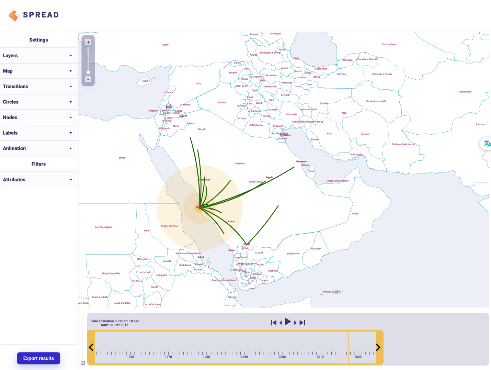